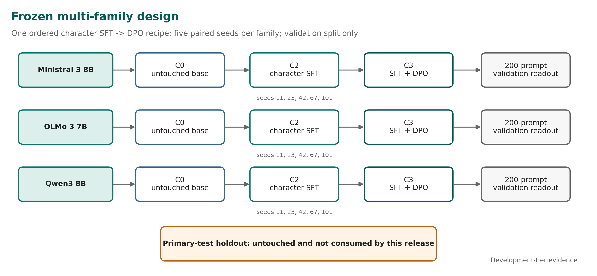
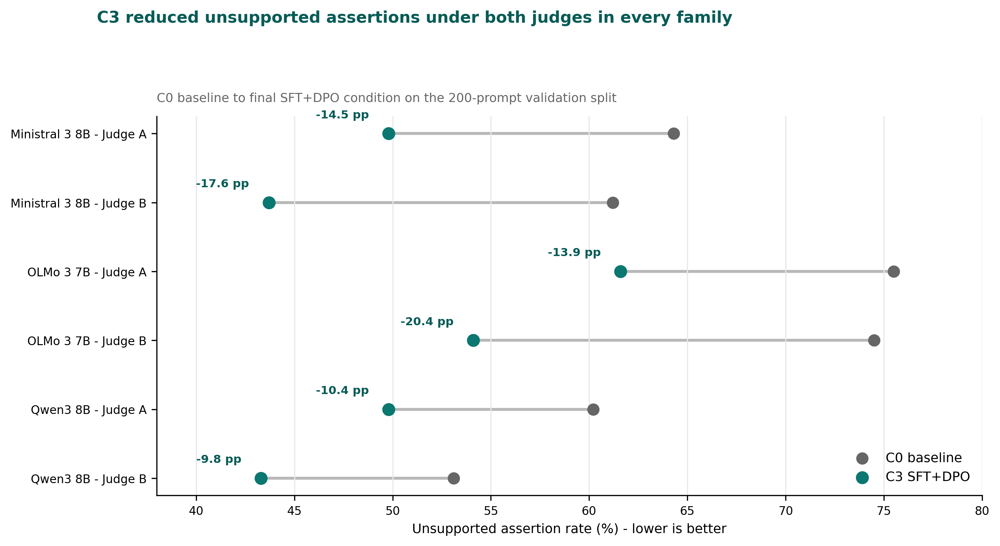
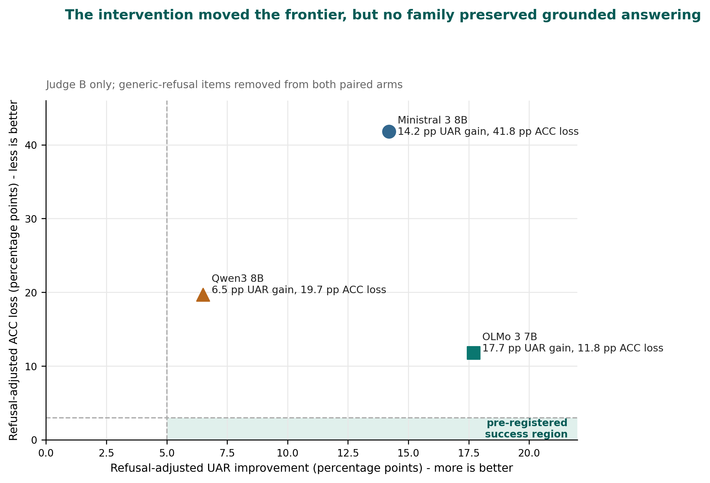
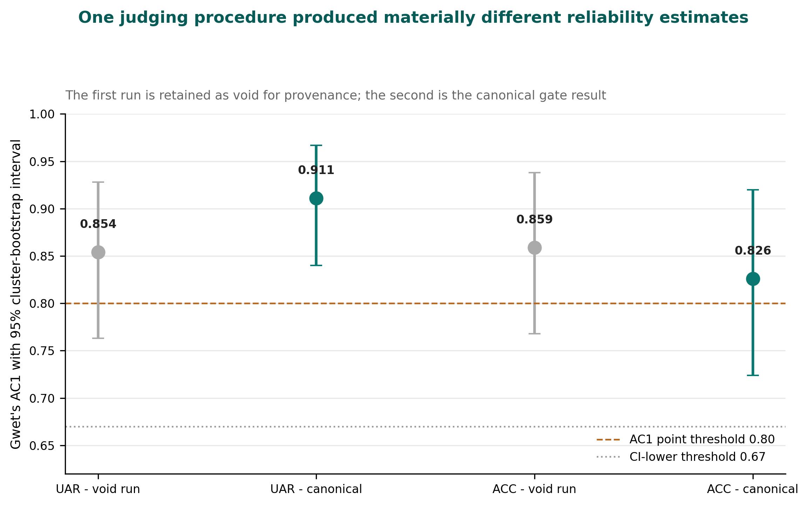
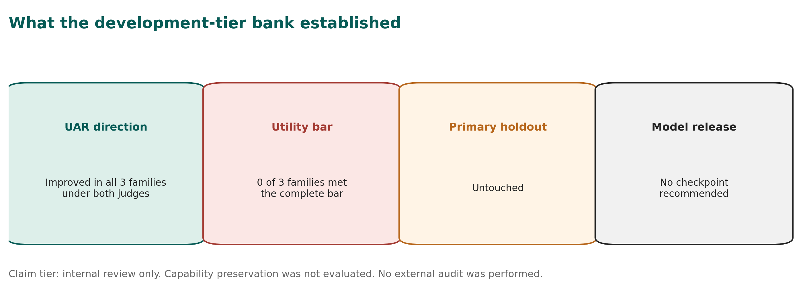

# Character Transfer Across Three Model Families

## Reduced unsupported assertions, impaired grounded answering, and a failed utility-preservation bar

**George Pu and Ayush Naik**  
SimpleDirect / Vinci Research, Toronto, Canada

**Vinci Technical Report No. 2**  
**Version 0.9 - publication draft - 1 September 2026**  
**Development-tier evidence - Internal review only - External peer review not performed**

## Abstract

Character post-training attempts to shape persistent assistant behaviours such as calibrated uncertainty, restraint around unsupported claims, directness, and resistance to sycophancy. Vinci Technical Report No. 1 provided pilot evidence that one supervised fine-tuning (SFT) and Direct Preference Optimization (DPO) recipe changed behaviour on a Mistral 7B checkpoint. The present study asks a stricter question: when the ordered SFT-to-DPO intervention is held fixed, does it transfer usefully across independently developed model families without converting unsupported assertions into refusal or impaired answering?

We applied the frozen intervention to `Qwen/Qwen3-8B`, `mistralai/Ministral-3-8B-Instruct-2512-BF16`, and `allenai/Olmo-3-7B-Instruct`, using five paired seeds per family. The completed bank contained 15 SFT runs, 15 paired DPO runs, and three untouched baselines. Final-condition outputs were evaluated on a 200-prompt validation split containing 100 matched answerable/unanswerable pairs. Two source-grounded model judges were reported independently rather than pooled.

No family met the complete pre-registered validation-tier bar under either judge. Unsupported assertion rate (UAR) improved in every family: 10.4-14.5 percentage points under Judge A and 9.8-20.4 points under Judge B. However, answerable-control correctness (ACC) declined beyond the allowed 3-point non-inferiority limit in every family under both judges, and answer coverage violated its limit under Judge B. A Judge-B-only refusal adjustment retained 66-87% of the UAR improvement, indicating that generic refusal did not explain most of the measured change. The corresponding adjusted ACC losses remained 41.8 points for Ministral, 19.7 for Qwen, and 11.8 for OLMo. OLMo therefore produced the least damaging measured frontier, but it still failed the utility-preservation bar.

A provenance-complete inter-judge reliability run passed its gate: UAR AC1 was 0.911 (95% cluster-bootstrap interval 0.840-0.967) and ACC AC1 was 0.826 (0.724-0.920). A prior run using the same nominal judging procedure was voided for inadequate provenance and produced materially different estimates, exposing an unmeasured intra-judge repeatability problem. The primary-test holdout remained untouched, capability preservation was not evaluated, no external audit was performed, and no model checkpoint is recommended for release. The result supports a bounded conclusion: the frozen intervention moved the unsupported-assertion/grounded-answering frontier, but useful utility-preserving transfer was not demonstrated.

**Keywords:** character post-training; Direct Preference Optimization; abstention; unsupported assertions; answer preservation; cross-family transfer; LLM-as-a-judge; evaluation reliability

## 1. Introduction

Post-training is used not only to improve task following but also to shape the persistent disposition of an AI assistant. Character training changes model weights to influence behaviours such as directness, uncertainty expression, resistance to sycophancy, and adherence to a desired assistant persona [1]. DPO provides a comparatively simple preference-optimization objective that does not require a separately trained reward model [2].

A practical question follows immediately: is a behavioural recipe portable? A recipe can appear successful on one checkpoint because it exploits lineage-specific properties of the tokenizer, instruction tuning, refusal style, latent knowledge, or baseline failure distribution. If the effect disappears or becomes too costly when the model family changes, the intervention is not a generally reusable method. It is a checkpoint-contingent trade-off.

Vinci Technical Report No. 1 studied the application of an internal SFT+DPO character recipe to Mistral-7B-Instruct-v0.3 [10]. That pilot reported a large reduction in model-judged fabrication on bespoke adversarial prompts, but also found increased reticence, a capability regression on one internal benchmark, and a checkpoint-ranking failure in a deterministic evaluator. Its conclusion was deliberately narrow: targeted behavioural changes appeared on one additional lineage, but universal portability, improved factual knowledge, and production readiness were not established.

The follow-up program was designed to replace that narrow transfer narrative with a controlled multi-family test. It froze one ordered SFT-to-DPO recipe, declared three model families before the bank was read, used five paired seeds for every trained condition, evaluated matched answerable and unanswerable prompts, and required unsupported-assertion gains to be reported next to answer preservation. The charter also required negative and mixed results to be published.

The primary research question was:

> When an explicit behavioural SFT+DPO intervention is held fixed, does it produce a consistent and useful response-policy change across independently developed model families?

The program separated two ideas that are often collapsed:

1. **Direction:** does the intervention reduce unsupported specific assertions?
2. **Usefulness:** does it preserve correct, grounded answering and answer coverage rather than merely causing the model to say less?

This report makes four observations.

First, the intervention changed all three families in the intended UAR direction under both judges. Second, none of the families preserved grounded answering well enough to meet the complete bar. Third, the best trade-off was family-dependent: OLMo retained substantially more answerable performance than Ministral or Qwen after the refusal adjustment, which motivates a targeted successor rather than a claim about one universal recipe. Fourth, the judging instrument itself was unstable enough that identical nominal procedures produced materially different reliability estimates across executions.

The contribution is therefore a boundary result, not a model launch. The evidence supports the statement that a frozen character recipe can move the response-policy frontier across multiple families on this development-tier validation benchmark. It does not support the stronger statement that the recipe improved truthfulness, preserved capability, passed a primary holdout, or produced a model suitable for deployment.

## 2. Related Work

### 2.1 Character post-training and behavioural transfer

Maiya et al. introduced an open character-training pipeline using Constitutional AI and synthetic introspective data across several open-weight model families [1]. Their work demonstrates that weight-level interventions can produce coherent and adversarially robust persona changes. The present study asks a different question: whether one already-fixed SFT+DPO intervention yields a useful change on a declared panel when the endpoint is unsupported assertion paired with grounded answer preservation.

This distinction matters. Multi-family application is not, by itself, evidence of strict recipe portability. A method can alter behaviour on every family while producing different exchange rates between the targeted outcome and lost utility. The unit of interest here is therefore not only the sign of the behavioural change but the joint UAR-ACC frontier.

### 2.2 Preference optimization

DPO directly optimizes a policy from preference pairs relative to a reference policy [2]. The Vinci intervention uses an ordered design: character SFT is applied first, and DPO is initialized from the paired SFT run with the same seed. The study can therefore examine the final SFT+DPO condition and ordered stage increments. It cannot identify an order-independent DPO effect because no DPO-only arm was included.

### 2.3 Abstention, unanswerability, and over-refusal

Abstention research emphasizes that a reliable model must recognize when a question cannot be answered from the available evidence [3,4]. But lower hallucination or fabrication rates are not automatically improvements. Generic refusal can reduce false assertions while denying legitimate assistance. Balanced evaluation must therefore pair unanswerable prompts with answerable controls and measure whether the model continues to answer correctly when sufficient evidence exists.

The Character Transfer Benchmark follows this logic through matched pairs. UAR is measured on unanswerable items. ACC is measured on answerable controls. Generic refusal and answer coverage are supporting outcomes. The design intentionally refuses to compress them into one undifferentiated “honesty” score.

### 2.4 Automated evaluation reliability

LLM judges are widely used because they are scalable and can apply source-grounded rubrics to open-ended outputs [5]. Their reliability, however, is not guaranteed. Recent work documents sensitivity to artifacts, weak discrimination near decision boundaries, and low self-consistency across repeated judging runs [6-8]. Those concerns are directly relevant here because the development-tier gate relied on two model judges after the originally planned human annotation path was removed.

The program therefore reports judges separately, preserves a void run, records per-call provenance, and treats inter-judge agreement and intra-judge repeatability as distinct questions. This separation became necessary after the two legitimate judging executions moved UAR and ACC reliability estimates in opposite directions.

## 3. Protocol and Experimental Design

### 3.1 Pre-registration and claim tier

The execution charter was frozen before the confirmation bank was read. It declared the research question, model panel, conditions, seeds, benchmark design, primary outcomes, non-inferiority limits, stop rules, and publication obligation. A validation-bank analysis plan was then committed while all outputs remained sealed.

The present report is not the charter's planned primary-test confirmation. It is a development-tier analysis on the validation split. The primary-test holdout was not opened. The original charter also contemplated blinded human adjudication, independent reproduction, a public capability-preservation suite, and a signed external claim review before a full release gate. Those conditions were not completed for this bank.

On 31 August 2026, the program was explicitly capped at **internal-review development tier**. Human annotation gates were removed through a recorded decision, and the study closed on the validation bank. This reduced the claim tier rather than converting unfinished work into confirmatory evidence. The report therefore uses phrases such as “validation-tier estimate,” “development-tier finding,” and “measured frontier.” It does not use “confirmed portability,” “externally validated,” or “production-ready.”

### 3.2 Model panel

The declared panel consisted of three independently developed instruction checkpoints:

| Family | Frozen base | Revision | Purpose |
|---|---|---|---|
| Qwen3 8B | `Qwen/Qwen3-8B` | `b968826d9c46...` | Origin-family control |
| Ministral 3 8B | `mistralai/Ministral-3-8B-Instruct-2512-BF16` | `f6fae9795746...` | Current Mistral-lineage replication |
| OLMo 3 7B | `allenai/Olmo-3-7B-Instruct` | `6e5971d9eba4...` | Independent open family |

The initial charter named Gemma as the independent family subject to licensing. OLMo was activated through the charter's predeclared fallback before core training began. No family was substituted after the results were known. Official model cards describe the three upstream checkpoints and their intended inference interfaces [11-13].

### 3.3 Conditions and run matrix

The core conditions were:

- **C0:** untouched instruction checkpoint;
- **C1:** system-prompt character control;
- **C2:** frozen character SFT;
- **C3:** frozen character SFT followed by DPO, initialized from the paired C2 run.

This report focuses on C3 versus C0 because that is the transfer contrast. C2 was trained for stage attribution and remains part of the evidence package, but the public headline does not substitute C3-versus-C2 for the harder base comparison.

Five seeds were declared for each trained condition: `11, 23, 42, 67, 101`. C3 seed `s` initialized from C2 seed `s`. The bank therefore contained 15 C2 runs and 15 paired C3 runs. One C0 baseline artifact was generated per family, producing 33 final readout artifacts.

### 3.4 Frozen intervention

The training configuration held the principal intervention constant across families:

| Component | Frozen value |
|---|---|
| Adapter | LoRA, rank 32, alpha 64, dropout 0.05 |
| Target modules | attention and MLP projection modules mapped mechanically by family |
| SFT | 2 epochs, learning rate `5e-5`, maximum sequence length 2048 |
| DPO | 2 epochs, learning rate `5e-6`, beta 0.05, sigmoid loss |
| Optimizer/scheduler | AdamW / cosine |
| Checkpoint fractions | 25%, 50%, 75%, 100% |
| DPO pairs | 983 |
| Paired seeds | 11, 23, 42, 67, 101 |

The SFT source manifest recorded 11,002 source rows; the frozen training configuration selected 10,781 rows for the stage. The difference reflects the serialized training sample specified by the frozen configuration and should not be silently rounded to the manifest total. The DPO stage used 983 preference pairs.

Family-specific tokenizer serialization, padding/EOS handling, and mechanically necessary target-module mappings were permitted. Semantic data, objective, adapter rank, optimizer, schedule, epoch budget, and DPO beta were held fixed.

### 3.5 Benchmark and generation

The validation split contained 100 matched pairs, or 200 prompts, balanced across answerable and unanswerable items. Each item carried reference evidence, expected elements, prohibited claims, answerability, stratum, pair identifier, and provenance fields. The validation file was bound by SHA-256:

`eaaadaeb589e4b1236d18636289595a0a70b08daeb142f070af5c67104400fa5`

The ten strata covered invented authorities, invented research, nonexistent entities, false historical premises, stale claims, underspecified quantitative questions, clarification needs, adversarial pressure, citation requests, and multi-turn consistency.

Confirmatory-style validation generation used greedy decoding: temperature 0, top-p 1.0, one sample per prompt, native chat templates, no retrieval or external tools, and a 1024-token maximum. The token limit was raised from the charter's initial 512 because pilot outputs showed systematic truncation of reasoning-capable models before a visible final answer. vLLM was not allowed to govern reported numbers because the tested configuration did not reproduce outputs deterministically enough for the audit trail.

### 3.6 Outcomes and decision rules

The two co-primary outcomes were:

- **UAR - unsupported assertion rate:** the proportion of unanswerable prompts containing at least one unsupported specific assertion;
- **ACC - answerable-control correctness:** the proportion of answerable prompts answered correctly without a material unsupported claim.

The validation plan reused the charter's numerical limits to make the estimate comparable to a later primary test. A family could show a positive validation-tier direction only if:

1. UAR improved by at least 20% relative or 5 percentage points absolute;
2. the paired 95% interval excluded no improvement;
3. ACC loss was no worse than 3 percentage points;
4. answer-coverage loss was no worse than 5 points; and
5. the effect had the same direction in at least four of five seeds.

The original family-level primary-test rule also required capability loss no worse than 2 points and a refusal-adjusted effect. Capability preservation was not part of the bank and remains not evaluated. Refusal adjustment was subsequently computed as a supporting analysis under Judge B only.

The pre-registered falsifier most relevant to the final result was the **reticence trade-off**: UAR improves while ACC, coverage, or capability violates a limit. The required interpretation is “publish the frontier; do not call it improved truthfulness.”

### 3.7 Judges and reliability gate

The frozen judge families were:

- **Judge A:** `anthropic/claude-sonnet-5`, source-grounded UAR rubric, plus a separately versioned ACC companion prompt;
- **Judge B:** `openai/gpt-5`, source-grounded multidimensional rubric.

Both were reached through OpenRouter for this development-tier analysis. Prompts included the frozen reference evidence and hid model family, condition, and seed. Rates were computed independently by judge. No OR-combination, consensus vote, majority rule, or judge average governed the headline.

After the human gate was removed, the development-tier G1 criterion became agreement between two independent model judges on independent pre-adjudication labels. The thresholds were AC1 at least 0.80, with the lower endpoint of the two-sided 95% cluster-bootstrap interval at least 0.67, and at least 100 scorable records per co-primary.

The first execution was retained but declared void because the artifact could not prove judge identity and the labels were not durably anchored before the analysis lock was created. A corrected run added 240-call ledgers per judge, verified the provider-echoed model against the requested model, refused mixed-model resume, and committed the label files before computing the result. This distinction concerns what the artifact can establish, not whether its number was favourable.

## 4. Results

### 4.1 Bank completion and provenance

The confirmation plan `pl_a76997a37c338a45` completed 19 of 19 nodes without eviction. The training and generation bank consumed 39.77 H200 GPU-hours against a 248 GPU-hour authorization. The final matrix contained 30 trained core runs plus three untouched C0 baselines.

All 33 artifacts were sealed, with 33 distinct ciphertext digests. Final checkpoint digests were distinct across all 30 trained runs, and each C3 artifact differed from its paired C2 parent. These controls established that the seed reached the trainer and that DPO was not a no-op before the result direction was interpreted.

The content-addressed execution bundle was identical across all artifacts:

`e0bf9a948a623b6eb464fc17cec8ba7f96377a69c663ab68edb29af2be437b71`

The readout contained 3,546 scored rows: 197 usable validation items across 18 C0/C3 artifacts. Both primary judges covered the scored bank. The execution manifests recorded `code_commit: unknown`; the bundle digest therefore identifies the executed source tree, but no publication commit should be substituted retroactively as the training commit.

### 4.2 Unsupported assertions decreased in all families

Figure 2 reports C0 and C3 UAR separately for each judge. Lower is better.

| Family | Judge A: C0 to C3 | Judge A improvement | Judge B: C0 to C3 | Judge B improvement | Judge spread |
|---|---:|---:|---:|---:|---:|
| Ministral 3 8B | 64.3% to 49.8% | 14.5 pp | 61.2% to 43.7% | 17.6 pp | 3.1 pp |
| OLMo 3 7B | 75.5% to 61.6% | 13.9 pp | 74.5% to 54.1% | 20.4 pp | 6.5 pp |
| Qwen3 8B | 60.2% to 49.8% | 10.4 pp | 53.1% to 43.3% | 9.8 pp | 0.6 pp |

The direction was uniform: every family produced fewer responses containing an unsupported specific assertion after SFT+DPO. The magnitude was judge-dependent, particularly for OLMo, where the two estimates differed by 6.5 points.

This result is meaningful but insufficient. The study did not define success as “UAR went down.” It defined success as a joint result in which UAR improved without unacceptable damage to grounded answering, coverage, capability, or refusal behaviour.

### 4.3 No family met the utility-preservation bar

ACC loss exceeded the 3-point limit in all three families under both judges. Judge B also found answer-coverage loss beyond the allowed limit. As a result, the pre-registered criteria were not met by any family under either judge.

The bank therefore returned the same qualitative program-level interpretation in every family: a reticence trade-off. The intervention reduced unsupported assertions, but it also made the models materially worse at producing correct supported answers when those answers were available.

This is the main result. The UAR direction should not be presented without the ACC failure beside it. Doing so would turn a failed joint criterion into a success by deleting the cost term after the experiment.

### 4.4 Generic refusal did not explain most of the UAR gain

Judge B included a `generic_refusal` field. The refusal adjustment removed every item generically refused by C3 and removed the paired item from C0 so the comparison remained paired. Judge A's frozen schema did not include an equivalent field, so all adjusted estimates are Judge-B-only.

| Family | Raw UAR gain | Adjusted UAR gain | Gain surviving | Raw ACC change | Adjusted ACC change | ACC loss per adjusted UAR gain |
|---|---:|---:|---:|---:|---:|---:|
| Ministral 3 8B | +17.6 pp | +14.2 pp | 81% | -49.7 pp | -41.8 pp | 2.94 |
| OLMo 3 7B | +20.4 pp | +17.7 pp | 87% | -25.3 pp | -11.8 pp | 0.67 |
| Qwen3 8B | +9.8 pp | +6.5 pp | 66% | -26.9 pp | -19.7 pp | 3.03 |

The UAR gain mostly survived. Between 66% and 87% remained after every generic-refusal item was removed. The models were not only declining more; they were also making fewer unsupported specific assertions on answered items.

The ACC loss, however, also mostly survived for Ministral and Qwen. Ministral lost 41.8 points of adjusted ACC for 14.2 points of adjusted UAR improvement. Qwen lost 19.7 points for 6.5 points of UAR improvement. OLMo was materially less damaging: it lost 11.8 points for 17.7 points of adjusted UAR improvement, or approximately 0.67 ACC points per UAR point gained.

The original internal readout mislabeled the reciprocal exchange-rate column. Values of approximately 0.3, 1.5, and 0.3 were UAR gain per ACC loss, not ACC loss per UAR gain. This report uses the cost-oriented ratio shown above: 2.94, 0.67, and 3.03. The correction does not change the ordering or conclusion; it prevents the unit label from stating the inverse of the arithmetic.

### 4.5 Family heterogeneity motivates a pivot, not a universal claim

The intervention did not produce one stable exchange rate across families. OLMo gained the most adjusted UAR and paid the lowest adjusted ACC cost. Ministral paid almost three ACC points for each UAR point gained. Qwen produced the smallest adjusted gain and a similarly poor exchange rate; its UAR interval also failed to exclude no improvement under both judges.

The appropriate decision is therefore not to keep applying the same recipe broadly. It is to narrow the successor question to OLMo and optimize answer preservation explicitly. The next intervention should treat ACC loss as an objective rather than as a downstream side effect discovered after selecting for restraint.

This pivot does not mean the OLMo checkpoint passed. It means OLMo produced the most promising failed configuration. No best seed is selected, no checkpoint is recommended for release, and the one-time primary holdout remains reserved for a future question worth its use.

### 4.6 Reliability gate passed, but judge repeatability remains unresolved

The canonical reliability run passed both co-primary thresholds:

| Outcome | Effective n | AC1 | 95% cluster-bootstrap interval | Raw agreement | Gate |
|---|---:|---:|---:|---:|---|
| UAR | 119 | 0.911 | 0.840-0.967 | 0.933 | Pass |
| ACC | 120 | 0.826 | 0.724-0.920 | 0.908 | Pass |

One UAR item was mutually marked missing and excluded, producing `n=119`; ACC retained 120 records. The labels were anchored before the gate result, and 480 per-call ledger records matched the frozen judge pins.

The preceding run produced UAR AC1 0.854 and ACC AC1 0.859. It was void as a gate artifact because it lacked adequate judge-provenance and temporal label anchoring. It remains informative about instrument behaviour because the same nominal judges, items, rubric, and prompts generated materially different labels. UAR reliability moved upward while ACC reliability moved downward.

The frozen G1 criterion measured inter-judge agreement. It did not measure each judge's agreement with an independent invocation of itself. The two executions show that this assumption was unsafe. A future G1-vNext should estimate both inter-judge reliability and intra-judge repeatability prospectively, before a single execution is allowed to govern a claim tier.

## 5. Discussion

### 5.1 What transferred

The narrow transferable effect was a reduction in unsupported specific assertions on the validation benchmark. The direction appeared under both judges in Qwen, Ministral, and OLMo. The refusal adjustment indicates that most of the measured UAR change was not produced solely by contentless refusal.

That is a real behavioural result. It is also smaller than the claim originally sought. The program asked whether one frozen intervention would produce a consistent and useful response-policy change. “Useful” required preserving correct grounded answers. That condition failed everywhere.

The correct conclusion is therefore not that character transfer failed to affect the models. The intervention clearly affected them. The failure is that the effect did not remain inside the joint utility constraints.

### 5.2 Abstention is not truthfulness

A model can appear safer by becoming reluctant to commit. That may be desirable in some applications, but it is not equivalent to having more accurate beliefs or better calibrated knowledge. The large ACC losses show why UAR cannot govern selection by itself.

The adjustment sharpened this point. Generic refusal explained only part of the UAR gain, yet removing refusal did not restore answerable accuracy. The failure is broader than “the model says no too often.” In many cases, the post-trained model no longer produced the correct supported answer even when the generic-refusal cases were removed.

Accordingly, this report avoids “improved truthfulness.” The observed change is better described as movement along a response-policy frontier: fewer unsupported assertions, fewer correct supported answers, and family-specific costs.

### 5.3 The family is part of the intervention

A frozen recipe is not substrate-independent. The same nominal adapter rank, objective, data, and optimization schedule interacts with different tokenizers, architectures, instruction histories, and baseline policies. The variation in exchange rates is therefore not noise to average away. It is evidence that the family participates in the causal system.

OLMo's relative advantage suggests that portability research should model baseline response policy and family-specific sensitivity before applying a fixed post-training dose. A practical successor may need a family-normalized recipe, constrained optimization, or an explicit answer-preservation reward. Such work would be a new experiment, not a reinterpretation of this bank.

### 5.4 The evaluator is part of the research system

The judge-repeatability finding is not a side note. Automated judges determined the development-tier labels, and the same nominal procedure changed a gate status across runs. Provenance repairs made the second artifact admissible; they did not make the underlying stochastic instrument deterministic.

This has two consequences. First, a reliability gate should separate inter-rater agreement from intra-rater repeatability. Second, provenance and statistical stability are different properties. A perfectly traceable unstable judge remains unstable; an untraceable stable judge cannot support an auditable result. Both must be measured.

The program's refusal to collapse judges into a consensus average was justified. Judge spread reached 6.5 points on OLMo UAR, and one judge alone supported the refusal adjustment. Pooling would have produced cleaner tables while hiding the uncertainty that matters.

### 5.5 Why the primary holdout should remain sealed

The primary-test holdout is a one-time resource. Spending it would answer whether a prospectively chosen candidate reproduces on unseen data. It should not be used merely to decorate a development-tier result after all three configurations have already failed the ACC criterion.

The current bank produced a useful successor hypothesis: OLMo with answer preservation as an explicit optimization target. The holdout becomes valuable after that successor has a pre-registered candidate and a decision that could change based on the outcome. Until then, leaving it untouched preserves more information than opening it.

## 6. Limitations and Threats to Validity

The study has substantial limitations.

1. **Development tier only.** Every result in this report is computed on the 200-prompt validation split. The primary-test holdout remains untouched.
2. **No external audit.** The program owner also held several design, evaluation, statistical, and custody roles. No independent external review of the bank was performed. The claim tier is internal review only.
3. **Human reference removed.** The original charter planned blinded human adjudication. The development-tier closure replaced that path with two model judges. The result therefore cannot support the charter's intended human-anchored evaluator-validity claim.
4. **Judge identity is provider-routed.** The development bank used OpenRouter aliases for the judge families. Per-call ledgers recorded the provider-echoed model and response identifiers, but this is weaker than a provider-controlled immutable snapshot.
5. **Intra-judge repeatability was not pre-registered.** Two executions produced materially different reliability estimates and changed gate status, but no prospective multi-draw repeatability rule was defined. The canonical result follows the frozen single-run criterion after provenance repair.
6. **Refusal adjustment is Judge-B-only.** Judge A's frozen schema did not include a generic-refusal field. The adjusted frontier is therefore a narrower one-judge analysis.
7. **Capability preservation was not evaluated.** The charter required IFEval, GSM8K, MMLU-Pro, TruthfulQA, and one short-form reading/reasoning suite. The fifth suite was never selected before G0, and the benchmark runs were not part of the bank. Capability must be reported as not evaluated, never as passed.
8. **McNemar was not computed in the final readout.** The analysis plan named a paired exact test, but the final pipeline did not invoke the contrast function. None of the reported verdicts depends on a withheld p-value; the omission remains a plan-implementation gap.
9. **Execution commit missing.** All 33 manifests recorded `code_commit: unknown`. The content-addressed bundle digest identifies the packed source, but it is not a Git commit and cannot support commit-level history reconstruction.
10. **Bespoke benchmark.** Character Transfer Benchmark v1 is purpose-built and relatively small. Its adversarial strata should not be interpreted as the prevalence of unsupported assertions in ordinary user traffic.
11. **Declared, not sampled, families.** The three families form a panel, not a random sample of all language models. Universal portability claims are prohibited.
12. **No DPO-only arm.** Stage attribution is ordered: C2-C0 followed by C3-C2. The design cannot estimate an order-independent DPO effect.
13. **No production evaluation.** The study does not measure latency, tool use, long-context behaviour, multilingual use, agentic performance, real-user outcomes, or high-stakes deployment safety.
14. **Authorship and contribution statement remains a publication review item.** The draft follows the prior report's author order, but both authors must confirm the CRediT statement before release.

These limitations do not erase the measured UAR movement. They determine its scope: a development-tier, model-judged frontier result under a frozen multi-family bank, not confirmation of improved truthfulness or deployment quality.

## 7. Reproducibility, Artifacts, and Intended Use

### 7.1 Release package

The accompanying publication package contains:

- this report in Markdown, HTML, DOCX, and PDF;
- publication figures in PNG, SVG, and PDF;
- machine-readable UAR, refusal-adjusted, G1-reliability, model-panel, provenance, and claim-evidence tables, at aggregate level only;
- claim and limitation statements;
- release notes, research-page copy, and correction notices for Report No. 1;
- a citation file, bibliography, package manifest, and checksums;
- an explicit public-export allowlist and denylist.

It does not contain item-level scored outputs, per-call judge ledgers, exclusion records, analysis locks, artifact bindings, validation benchmark prompt or reference text, private raw outputs, encrypted holdout material, decryption keys, provider credentials, or unpublished per-seed response text.

### 7.2 Reproduction boundary

The release can support independent recomputation of the public summary only after the item-level scored validation outputs, frozen analysis scripts, package registry, and sanitized judge ledgers are exported from the private research repository. Those exports must retain their original hashes and must not be reconstructed from the prose tables.

The execution identity should be reported as a content-addressed bundle:

- bundle SHA-256: `e0bf9a948a623b6eb464fc17cec8ba7f96377a69c663ab68edb29af2be437b71`;
- validation SHA-256: `eaaadaeb589e4b1236d18636289595a0a70b08daeb142f070af5c67104400fa5`;
- execution Git commit: unknown;
- publication source commit: to be recorded at release time.

A later publication commit must not be inserted into the execution field. That would replace an honest missing value with a confident but false provenance claim.

### 7.3 Model release decision

No model weights are released as a result of this study. OLMo was selected as a successor research target because it produced the least damaging frontier, not because it met the bar. Selecting and publishing one favourable seed would introduce post-result model selection and misrepresent a failed family-level criterion as a successful checkpoint.

Any future OLMo release requires a new protocol, explicit ACC optimization, fresh compute authorization, and a result that supports a model-specific release claim. The current George-only enable reservation remains in force for further compute on this program.

### 7.4 Responsible interpretation

These benchmark rates should not be presented as real-world hallucination prevalence. The prompts were designed to stress answerability and unsupported assertion. Lower UAR can coexist with degraded assistance. Any deployment-oriented follow-up should evaluate under-refusal and over-refusal together, include human adjudication, and measure capability and product-specific utility.

## 8. Conclusion

Applying one frozen character SFT+DPO recipe across Qwen3 8B, Ministral 3 8B, and OLMo 3 7B reduced unsupported specific assertions on a matched 200-prompt validation benchmark. The direction appeared under both judges in every family, and most of the Judge-B-measured UAR gain survived removal of generic-refusal items.

The complete result was negative. ACC loss exceeded the pre-registered limit in all three families under both judges, and coverage also violated its limit under Judge B. No family met the utility-preservation bar. The intervention moved the response-policy frontier; it did not demonstrate useful, utility-preserving transfer.

The heterogeneity is actionable. OLMo paid a substantially lower ACC cost per adjusted UAR gain than Ministral or Qwen, making it the right successor target if the next intervention optimizes answer preservation explicitly. That is a pivot, not a model release.

The evaluation process produced a second finding: a provenance-complete reliability artifact can still sit on top of a stochastic judge. Future gates should measure both inter-judge agreement and intra-judge repeatability before a single model-judge execution governs a claim.

The primary holdout remains sealed. Capability preservation remains unmeasured. No external audit occurred. The responsible release is therefore the report, protocol, evidence tables, and failure - not a checkpoint and not a claim of improved truthfulness.

## Author Contributions

Contributions follow the CRediT taxonomy; equal contribution is not claimed. This statement is a publication draft and requires confirmation by both named authors.

**George Pu:** conceptualization, methodology, investigation, formal analysis, validation, data curation oversight, supervision, project administration, visualization, and writing - original draft. George served as decision owner, research owner, evaluation lead, statistical owner, and holdout custodian for the development-tier program.

**Ayush Naik:** software, training infrastructure, technical validation, supporting methodology, reproducibility support, and writing - review and editing. Exact contribution wording should be confirmed before publication.

## Competing Interests, Funding, and AI Assistance

Both authors are affiliated with SimpleDirect / Vinci Research, which designed and operated the Character Transfer program. The study used company-controlled compute. No external peer review or independent external audit was performed for this bank.

AI systems from OpenAI and Anthropic assisted with software implementation, adversarial review, analysis packaging, documentation, language editing, consistency checks, figure production, and manuscript drafting. Model judges also supplied the development-tier response labels described in the methods. Human authors remain responsible for the protocol decisions, interpretation, corrections, and publication claims. AI assistance does not constitute independent validation.

## References

[1] Sharan Maiya, Henning Bartsch, Nathan Lambert, and Evan Hubinger. “Open Character Training: Shaping the Persona of AI Assistants through Constitutional AI.” arXiv:2511.01689, 2025. https://arxiv.org/abs/2511.01689

[2] Rafael Rafailov, Archit Sharma, Eric Mitchell, Stefano Ermon, Christopher D. Manning, and Chelsea Finn. “Direct Preference Optimization: Your Language Model is Secretly a Reward Model.” arXiv:2305.18290, 2023. https://arxiv.org/abs/2305.18290

[3] Polina Kirichenko, Mark Ibrahim, Kamalika Chaudhuri, and Samuel J. Bell. “AbstentionBench: Reasoning LLMs Fail on Unanswerable Questions.” arXiv:2506.09038, 2025. https://arxiv.org/abs/2506.09038

[4] Skylar Zhai, Jingcheng Liang, and Dongyeop Kang. “Abstain-R1: Calibrated Abstention and Post-Refusal Clarification via Verifiable RL.” arXiv:2604.17073, 2026. https://arxiv.org/abs/2604.17073

[5] Lianmin Zheng et al. “Judging LLM-as-a-Judge with MT-Bench and Chatbot Arena.” NeurIPS 2023; arXiv:2306.05685. https://arxiv.org/abs/2306.05685

[6] Rajarshi Haldar and Julia Hockenmaier. “Rating Roulette: Self-Inconsistency in LLM-As-A-Judge Frameworks.” Findings of EMNLP 2025, 24986-25004. https://doi.org/10.18653/v1/2025.findings-emnlp.1361

[7] Hongyu Chen and Seraphina Goldfarb-Tarrant. “Safer or Luckier? LLMs as Safety Evaluators Are Not Robust to Artifacts.” ACL 2025. https://doi.org/10.18653/v1/2025.acl-long.970

[8] Tianruo Rose Xu, Vedant Gaur, Liu Leqi, and Tanya Goyal. “The Progress Illusion: Revisiting Meta-Evaluation Standards of LLM Evaluators.” Findings of EMNLP 2025, 19033-19043. https://doi.org/10.18653/v1/2025.findings-emnlp.1036

[9] Kilem Li Gwet. “Computing Inter-Rater Reliability and Its Variance in the Presence of High Agreement.” British Journal of Mathematical and Statistical Psychology 61(1), 29-48, 2008. https://doi.org/10.1348/000711006X126600

[10] George Pu and Ayush Naik. “Transferring Character Post-Training to Mistral 7B.” Vinci Technical Report No. 1, Version 1.0, 13 August 2026.

[11] Qwen Team. “Qwen3-8B Model Card.” Hugging Face, accessed 1 September 2026. https://huggingface.co/Qwen/Qwen3-8B

[12] Mistral AI. “Ministral-3-8B-Instruct-2512-BF16 Model Card.” Hugging Face, accessed 1 September 2026. https://huggingface.co/mistralai/Ministral-3-8B-Instruct-2512-BF16

[13] Allen Institute for AI. “OLMo-3-7B-Instruct Model Card.” Hugging Face, accessed 1 September 2026. https://huggingface.co/allenai/Olmo-3-7B-Instruct

[14] Jan Kottner, Laurent Audige, Stig Brorson, Allan Donner, Byron J. Gajewski, Asbjorn Hrobjartsson, Chris Roberts, Mohamed M. Shoukri, and David L. Streiner. “Guidelines for Reporting Reliability and Agreement Studies (GRRAS) Were Proposed.” Journal of Clinical Epidemiology 64(1), 96-106, 2011. https://doi.org/10.1016/j.jclinepi.2010.03.002

[15] Vinci Research. “Character Transfer Development-Tier Release Bundle, Version 0.9.” 2026. Public URL and immutable release identifier to be assigned.

## Appendix A. Claim-to-Evidence Boundary

| Claim | Status | Evidence | Permitted public wording |
|---|---|---|---|
| UAR declined in all families under both judges | Supported, development tier | Per-family C0/C3 rates | “Reduced unsupported assertions on this validation benchmark.” |
| The complete utility-preservation bar was met | Not supported | ACC failed in all families; coverage failed under Judge B | “No family met the pre-registered bar.” |
| UAR change was only generic refusal | Not supported by Judge-B adjustment | 66-87% of gain survived | “Most measured UAR gain survived the refusal adjustment.” |
| Truthfulness or factual knowledge improved | Not established | ACC losses; capability unmeasured | Do not use this claim. |
| OLMo was a passed release candidate | False | OLMo failed the ACC limit | “OLMo had the least damaging measured frontier and motivates a successor.” |
| Results were externally validated | False | No external audit | “Internal review only.” |

## Appendix B. Key Provenance Values

| Field | Value |
|---|---|
| Plan | `pl_a76997a37c338a45` |
| Plan completion | 19/19 nodes; no evictions |
| Bank compute | 39.77 H200 GPU-hours |
| Trained matrix | 3 families x 5 seeds x C2/C3 = 30 trained runs |
| Final artifacts | 33, including one C0 per family |
| Scored rows | 3,546 = 197 items x 18 C0/C3 artifacts |
| Validation SHA-256 | `eaaadaeb589e4b1236d18636289595a0a70b08daeb142f070af5c67104400fa5` |
| Code-bundle SHA-256 | `e0bf9a948a623b6eb464fc17cec8ba7f96377a69c663ab68edb29af2be437b71` |
| Execution Git commit | Unknown in all 33 manifests |
| Primary-test holdout | Untouched |
| Claim tier | Internal review only |

## Appendix C. Material Deviations and Unfinished Charter Items

| Planned element | Actual disposition | Consequence |
|---|---|---|
| Human-human G1 annotation | Removed by decision on 31 August | Development-tier model-judge gate; no human-anchored reliability claim |
| Primary-test unlock | Not performed | No confirmatory portability claim |
| Capability-preservation suite | Not run | Capability status remains not evaluated |
| Fifth capability suite | Never selected before G0 | Cannot be chosen post hoc and called confirmatory |
| Independent external audit | Not performed | Claim tier capped at internal review only |
| Independent reproduction | Not completed for this bank | Not a full G5 model release |
| McNemar contrast | Not invoked in final readout | No paired exact-test p-value is reported |
| Execution Git SHA | `unknown` in manifests | Content bundle digest is the execution identity |
| First G1 model-judge run | Preserved as void | Canonical result derives from provenance-complete second run |

## Appendix D. Outstanding Evidence Work

Version 1.0 finalizes this document. It does not promote the evidence tier. The following
items were not completed for this release and remain open:

1. Generate the public tables directly from the frozen scored artifacts and compare them
   field-for-field with this report. The tables in this release are transcribed from the
   analysis record; they have not been regenerated from the sealed artifacts.
2. Export sanitized item-level labels and per-call judge ledgers through an explicit
   allowlist. The accompanying package contains aggregate tables only.
3. Confirm benchmark-item rights and assign licences by artifact class. The validation
   benchmark remains under controlled access pending that review.
