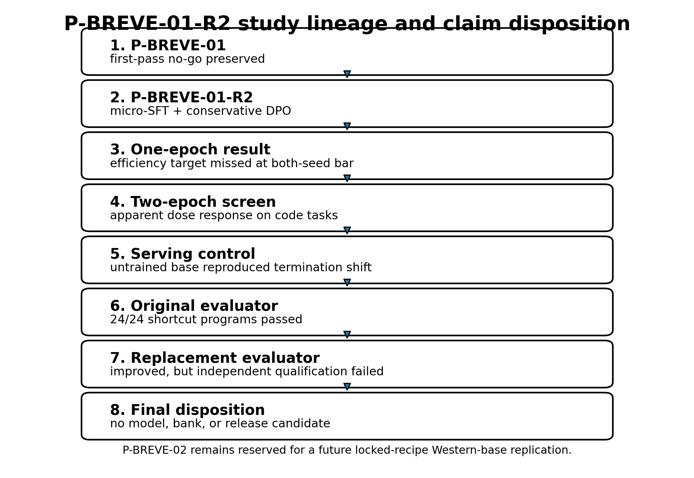
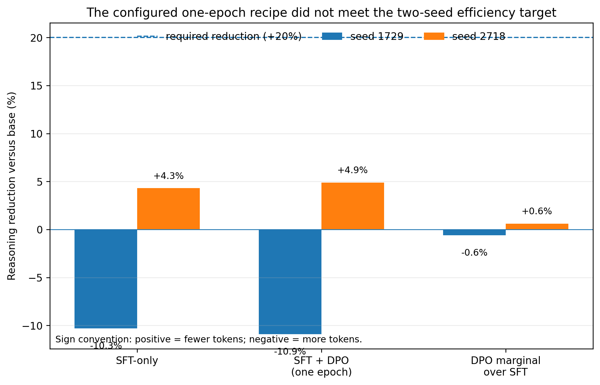
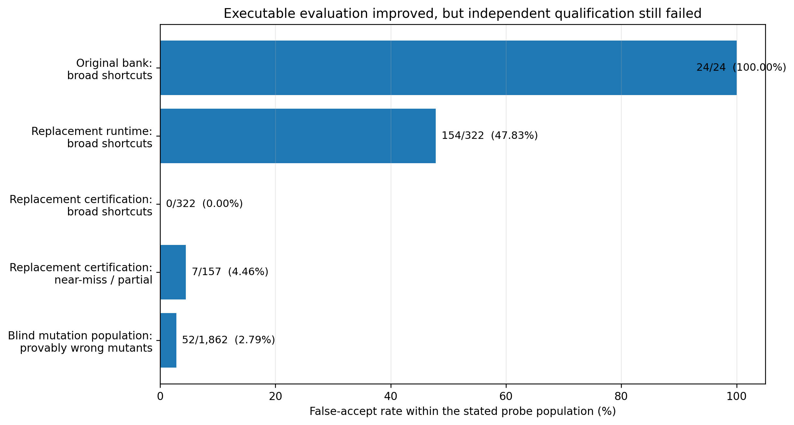
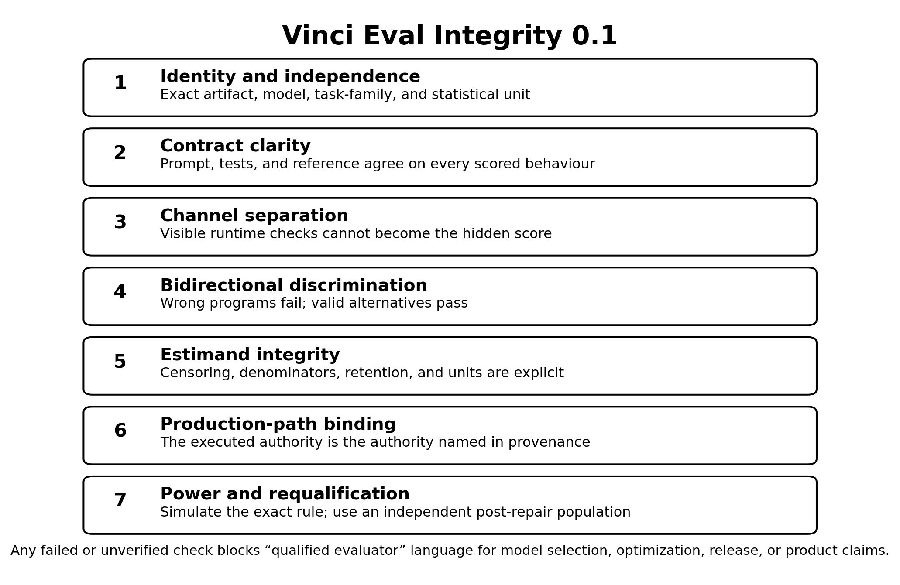

> **Unpublished corrected candidate — package revision 1.0.3.** This
> repository-forward derivative has not been published, tagged, uploaded to
> Zenodo, or submitted to arXiv. The published v1.0 PDF remains a frozen
> historical artifact and contains residual pre-finalization instructions that
> are corrected in this candidate.

## Abstract

Reasoning-capable language models can consume large inference budgets without delivering a usable answer. P-BREVE-01-R2 tested whether a small supervised fine-tuning (SFT) stage followed by conservative length-debiased Direct Preference Optimization (DPO) could make `Qwen/Qwen3.8-27B` allocate reasoning effort more proportionally, terminate reliably, preserve correct delivery, and avoid learning a global “shorter is better” rule. The intervention used a BF16 rank-32 LoRA, 440 accepted SFT demonstrations, 700 accepted DPO pairs, and a frozen two-seed development evaluation. The original evaluation bank contained 400 tasks across direct, closed-form, executable-code, agentic, and answerability strata.

The configured one-epoch SFT-to-DPO recipe did not meet its pre-registered efficiency objectives. Throughout this report, **reasoning reduction versus base is signed so that positive values mean fewer tokens and negative values mean more tokens**. On that metric, the one-epoch SFT+DPO arm scored **−10.9% at seed 1729 (longer than base)** and **+4.9% at seed 2718 (shorter than base)**, against a required **+20% reduction at both seeds**. The marginal reasoning reduction from adding DPO after SFT was −0.6% and +0.6%, providing no evidence of a meaningful one-epoch DPO effect. That one-epoch result was negative on oracle-independent efficiency measures before the later evaluator audit; it was not an apparent gain that was subsequently withdrawn. A bounded two-epoch screen produced an apparent dose response on executable-code token and cap-exhaustion measures under the study’s `reasoning_effort=xhigh` serving condition. A subsequent serving-control experiment showed that changing untrained base weights from `xhigh` to the neutral `medium` setting moved executable-code cap exhaustion from 65% to 0% on the screened shard and reduced restricted mean reasoning length from 6,407 to 608 tokens. The formal matched-effort comparison remained underpowered, but the result was sufficient to show that the **two-epoch dose response** could not be attributed cleanly to trained weights. The adapter was retired and no checkpoint was selected for release.

The stronger finding came from auditing the evaluator. The original executable-code bank accepted 24 of 24 deliberately incorrect shortcut programs, including branches that returned the expected output from input length without reading input values. Its 80 nominal code tasks represented eight content-distinct problems cloned ten times, and its apparent capability residual included specification-ambiguous tasks. Correctness claims dependent on that bank were therefore withdrawn or suspended; raw token and termination measurements were retained only within their narrower scope.

A replacement 40-task runtime/certification design improved discrimination but remained unqualified. The visible runtime channel accepted 154 of 322 broad shortcut probes, while the protected certification channel accepted none of those 322. Certification nevertheless accepted 7 of 157 near-miss or partial programs, and the frozen grader rejected 7 of the bank’s 40 correct reference implementations because of a non-behavioural abstract-syntax restriction. A later independently constructed mutation population generated 1,862 provably wrong mutants; 52 passed certification, with at least one leak in 19 of 40 protected tasks. The cross-method affected-task lower bound was composed explicitly as **seven previously identified Defect-B tasks plus fourteen newly adjudicated tasks outside that set, yielding at least 21 of 40 tasks with a known certification flaw**. This union count is distinct from the same source document’s complementary statement that 21 of 40 tasks showed no leak under the mutation population alone.

P-BREVE-01-R2 is therefore a negative model-intervention result and a positive evaluator-audit result. It supports three bounded conclusions: the configured conservative SFT+DPO recipe did not establish a training-attributable reasoning-efficiency improvement; serving-time effort controls dominated the observed termination phenotype on the screened code tasks; and executable success is not evidence of correctness until the evaluator has survived independent shortcut, near-miss, valid-alternative, independence, censoring, and power checks. The report distills those failures into **Vinci Eval Integrity 0.1**, a seven-check admission record covering statistical identity, contract clarity, channel separation, bidirectional discrimination, estimand integrity, production-path binding, and power with independent post-repair requalification. No model, bank, or release candidate resulted from the study.

**Keywords:** reasoning efficiency; overthinking; Direct Preference Optimization; executable evaluation; verifier validity; reward hacking; mutation testing; hidden tests; negative results; open-weight language models

**Publication record.** Version 1.0; research evidence cutoff `7cdfb4b68b7265be7f6c7299b107ff9d924f2a2d` (private research repository `getsimpledirect/vinci-gpu-research`, program directory `p-breve-01-r2/`); canonical report page: [https://www.getsimpledirect.com/research/papers/runtime-pass-is-not-correctness](https://www.getsimpledirect.com/research/papers/runtime-pass-is-not-correctness). The evidence cutoff is a research-record identity, not a claim that every execution manifest contained a Git commit.

## 1. Introduction

Large reasoning models can improve difficult-task performance by generating long intermediate traces, but the same mechanism can spend substantial compute on unnecessary reconsideration, repeat already completed derivations, or reach a generation limit before returning a usable final answer. This creates a practical optimization problem: reduce waste without suppressing the reasoning that difficult tasks genuinely require.

Recent work attacks this problem through adaptive inference policies, learned stopping signals, optimal-stopping controllers, and per-step effort routers [3–6]. These approaches share an important requirement. A system may only stop earlier when the shorter trajectory still delivers the correct outcome. Token reduction alone is not an adequate objective. A model that stops by refusing, guessing, truncating, skipping verification, or exploiting an incomplete evaluator can appear efficient while becoming less useful.

P-BREVE-01-R2 studied a weight-level intervention rather than a stand-alone inference controller. The intended policy was task-conditional:

- easy tasks should receive brief or empty reasoning and an exact requested final;
- closed-form problems should receive one sufficient derivation rather than repeated derivation;
- executable-code tasks should receive a verified implementation in the requested output format;
- agentic tasks should use tools, consume feedback, and verify the resulting state before declaring completion;
- unanswerable tasks should identify missing information rather than guess, loop, or exhaust the token budget; and
- genuinely hard tasks should retain sufficient depth.

The intervention combined small SFT with conservative DPO. SFT established the desired response grammar and examples of proportional reasoning. DPO then preferred less redundant trajectories only where both candidates independently satisfied the same task authority; guardrail pairs preferred correct and verified responses over shorter but defective alternatives. More than half of accepted pairs deliberately had a chosen response that was not shorter than the rejected response. The design was intended to make correctness outrank length.

The primary research question was:

> Can micro-SFT followed by conservative length-debiased DPO improve Qwen3.8-27B’s reasoning allocation, final-channel discipline, and verified delivery without replacing reasoning with generic brevity, refusal, or unverified action?

The study initially appeared to produce a mixed answer. The one-epoch recipe failed its efficiency target, while a stronger dose appeared to reduce code-stratum reasoning and cap exhaustion. Further controls then showed that the serving harness itself injected an `xhigh` reasoning instruction, and that changing the untrained base model to a neutral effort setting reproduced or exceeded the termination improvement. The trained effect was no longer identifiable from the apparent dose response.

More consequentially, the correctness evaluator failed adversarial qualification. A verifier can be deterministic, content-addressed, reproducible, and wrong. The original bank ran code and returned stable results, but its tests did not distinguish general implementations from trivial programs specialized to the small visible input set. It also counted repeated variants of eight underlying problems as 80 independent tasks. These defects did not merely add uncertainty to the reported accuracy. They changed what the number meant.

This report therefore makes five contributions.

First, it reports a bounded negative result for the configured one-epoch SFT+DPO intervention. Second, it separates an apparent two-epoch dose response from a serving-control effect and explains why the adapter was retired. Third, it demonstrates a concrete failure of executable verification: 24 of 24 adversarial non-solutions passed the original code bank. Fourth, it reports the strengths and remaining failures of a replacement runtime/certification design across broad shortcuts, near-miss programs, valid alternatives, and an independently constructed mutation population. Fifth, it documents the claim-withdrawal and correction process—including which measurements remain interpretable and which do not—and distills the resulting requirements into **Vinci Eval Integrity 0.1**, a seven-check evaluator-admission record.

The result is not a model launch. It does not establish that preference optimization cannot improve reasoning efficiency, that Qwen3.8-27B generally overthinks, that safety was preserved, or that the replacement bank is qualified. It establishes that this recipe did not earn its intended claim and that the measurement system required deeper qualification than the original program had imposed.

## 2. Related Work

### 2.1 Adaptive reasoning and early stopping

Difficulty-adaptive inference provides a direct alternative to weight-level post-training. DiffAdapt selects among easy, normal, and hard inference strategies using a lightweight difficulty probe and reports token reductions of up to 22.4% while maintaining comparable or improved benchmark performance [3]. ESTAR learns self-generated stopping signals and combines SFT with stop-aware reinforcement learning; its reported experiments reduce average reasoning length from 4,799 to 1,290 tokens while preserving similar accuracy [4]. OS-Pruner formulates chain-of-thought truncation as an optimal-stopping problem and reports generation-length reductions of 20–60% with limited accuracy loss [5]. Ares chooses reasoning effort per step in multi-step agents and reports reductions of up to 52.7% in reasoning tokens with limited task-success degradation [6].

These systems differ in training requirements and control granularity, but all make the same conceptual move: reasoning effort should depend on evidence about the task rather than remain globally fixed. P-BREVE-01-R2 began from the same principle. Its failure to isolate a weight-level effect, together with the strength of the `medium` serving control, pushes the evidence toward controller-first investigation rather than stronger preference tuning on the same base.

### 2.2 Direct Preference Optimization and length control

DPO provides a supervised classification objective for fitting a policy to pairwise preferences relative to a reference model, avoiding a separately trained reward model and an online reinforcement-learning loop [2]. In reasoning-efficiency work, however, the preference relation is easy to misspecify. If shorter responses are usually labeled preferred, a policy can learn generic brevity rather than task-conditional efficiency. Conversely, if guardrail examples dominate without any within-task efficiency contrast, the dataset may protect correctness while supplying too little gradient toward reduced waste.

P-BREVE-01-R2 used two explicit pair types. Efficiency pairs required both branches to pass the same authority before preferring the less redundant one. Guardrail pairs preferred correct, complete, and verified responses over guesses, truncations, format violations, answerable refusals, or unverified agent actions. The accepted set contained 218 efficiency pairs and 482 guardrail pairs; 56.6% of chosen branches were not shorter than their rejected alternatives. This prevented a simple corpus-level “always shorter” rule, but the corpus still contained no efficiency pairs for the executable-code or agentic-decision-state families. That defect is relevant to interpretation, although it does not explain the complete result: the strata with explicit efficiency pairs did not show the intended gain, while the code stratum without such pairs produced the largest apparent dose response under `xhigh`.

### 2.3 Executable rewards, public tests, and reward hacking

Code-generation systems often treat passing tests as an objective measure of correctness. That interpretation depends on the tests. Insufficient coverage can create false-positive rewards and encourage policies to exploit visible cases rather than satisfy the underlying specification. RobustTests explicitly uses faulty programs to synthesize cases that expose logical gaps in code rewards [7]. SWE-Mutation evaluates generated test suites by measuring whether systematically mutated programs can still pass, and reports low detection rates for current models on realistic agent-generated mutants [8]. CodeAssay combines audited references, public and hidden tests, and mutation-based validation; auditing changed 9.0% of fixed-output correctness labels in its reported experiment [9].

Reward-hacking benchmarks show that the issue is not hypothetical. BAITBENCH places optional shortcuts in machine-learning tasks that inflate a public metric while failing hidden evaluation and reports reward-hacking behaviour in 57.1% of tested frontier-agent runs [10]. The relevance to P-BREVE is structural rather than identical: a program can maximize the observable proxy while violating the intended task, and the proxy itself may not reveal the violation.

### 2.4 Mutation testing as evaluator qualification

Mutation testing evaluates a test suite by introducing controlled faults and measuring which faults the suite detects [11]. Applied to model evaluation, it asks a more useful question than whether the reference solution passes: does the evaluator reject programs that are wrong in plausible, specification-relevant ways, while continuing to accept legitimate alternatives?

P-BREVE’s initial audit used human-designed shortcut and near-miss programs. A later audit generated first-order abstract-syntax-tree mutations from the reference implementations and admitted only mutants that demonstrably disagreed with the reference on generated inputs. Neither method was exhaustive. Their value came from finding different defects. The combined record shows why evaluator qualification cannot rely on one mutation family, one author, or one repair population.

## 3. Study Lineage and Protocol

### 3.1 P-BREVE-01 and the R2 recovery study

P-BREVE-01 was an earlier bounded study on the same pinned Qwen3.8-27B substrate. Its revised first-pass gate ended in a no-go before training. That result remains closed and unchanged. P-BREVE-01-R2 was created as a narrower recovery study focused on task-conditional stopping, exact final-channel discipline, and verified agentic behaviour.

The identifier matters. R2 is not `P-BREVE-02`. The original charter reserves `P-BREVE-02` for a future locked-recipe reproduction on a Western 24–32B base. The present report covers the Qwen recovery lineage only and does not consume that future identifier.

### 3.2 Evidence tier and report cutoff

All model results in this report are development-tier internal evidence. No sealed primary product-weighted holdout was opened, no external peer review was performed, and no independent external laboratory reproduced the result. Several evaluator audits were designed and run after defects were discovered rather than before the model experiment. They are valuable diagnostic evidence, not confirmatory evidence about a pre-registered auditor hypothesis.

### 3.3 Model and serving stack

The frozen substrate was `Qwen/Qwen3.8-27B` at revision [1]:

`1d4bf0f2ff6012fd82039f2fa52739d0dd7c60c0`

Training used BF16 weights and adapters without quantization. Evaluation ran on the Vinci H200 fleet using the pinned Qwen chat template and a vLLM-based serving path. The final adapter was served attached rather than merged. In an eight-fixture parity test, BF16 merging produced token-identical greedy output on only five fixtures and consequential divergence on one cap-truncated fixture. Adapter-attached serving was therefore designated the canonical evidence path.

The pinned chat template exposed a serving variable that became central to the result. `reasoning_effort=xhigh` injected a natural-language instruction to think carefully, validate assumptions, and consider alternatives. `medium` injected no effort-specific instruction and served as the neutral baseline. `low` injected a brief-reasoning instruction. An absent effort value resolved to `xhigh`.

### 3.4 Intervention

The intervention was frozen as follows.

| Component | SFT | DPO |
|---|---:|---:|
| Accepted examples | 440 demonstrations | 700 preference pairs |
| Precision | BF16 | BF16 |
| Adapter | LoRA rank 32, alpha 64, dropout 0.05 | continued from accepted SFT adapter |
| Epochs | 1 | 1 in the primary configured recipe |
| Learning rate | `1e-5` | `5e-6` |
| Schedule | cosine, 3% warmup | frozen training configuration |
| Maximum complete sequence length | 8,192 | 8,192 per branch |
| Quantization | none | none |
| DPO beta | — | 0.10 |
| Length coefficient | — | 0.05 |
| Reference policy | — | exact accepted SFT checkpoint |

SFT loss applied only to assistant reasoning, final-answer, and tool-call tokens. System, user, and tool-result tokens were masked. DPO prompts and tool-result spans were likewise masked. Silent truncation was prohibited.

### 3.5 Data construction and acceptance

The data program generated 2,000 rollout rows from a declared 600-prompt training-only pool plus inherited, re-verified anchors. The accepted SFT and DPO artifacts were assembled only after schema, hash, authority, overlap, and family-balance checks. Unknown outcomes were quarantined rather than interpreted as passes.

The accepted DPO set contained two classes:

| Pair type | Count | Intended function |
|---|---:|---|
| Efficiency | 218 | Both branches pass the same authority; prefer less redundant reasoning or a cleaner final contract |
| Guardrail | 482 | Prefer correct, complete, verified behaviour over shorter but defective behaviour |
| **Total** | **700** | |

The chosen response was not shorter in 56.6% of accepted pairs. Guardrail pairs represented 68.9% of the corpus. These properties made a corpus-wide length shortcut less attractive, but they did not guarantee that each semantic family carried a useful efficiency gradient.

### 3.6 Original evaluation bank

The frozen R2-G4 development bank contained 400 nominal tasks:

| Stratum | Nominal tasks |
|---|---:|
| Direct/easy | 80 |
| Closed-form | 80 |
| Executable code | 80 |
| Agentic tool use | 80 |
| Answerability | 80 |
| **Total** | **400** |

Base and adapter conditions were evaluated on matched tasks under two fixed inference seeds, 1729 and 2718. Each arm therefore contained 800 episodes. The base-versus-adapter comparison contained 1,600 matched episodes.

The original positive-efficiency gates required, at both seeds:

- at least 20% lower median reasoning tokens;
- at least 15% lower median total generated tokens;
- at least 15% lower agentic generated tokens including retries;
- no increase in cap exhaustion or severe degeneration; and
- no material regression in correctness, final validity, answerable refusal, tool serialization, or safety outcomes.

Correctness-dependent gates are reported here only as historical design requirements. After the executable-code bank failed adversarial qualification, they could no longer support model-level conclusions.

### 3.7 Bounded dose and serving-control screens

After the one-epoch recipe failed, the program authorized one bounded dose-response test from the same SFT checkpoint and the same 700 pairs. The DPO dose changed from one to two epochs. The evaluation data and serving condition remained fixed.

A later six-arm serving-control screen crossed checkpoint identity with effort configuration:

| Arm | Checkpoint | Effort |
|---|---|---|
| A1 | Base | `xhigh` |
| A2 | Base | `medium` |
| A3 | Base | `low` |
| A4 | Base | thinking disabled |
| A5 | Two-epoch DPO | `xhigh` |
| A6 | Two-epoch DPO | `medium` |

The screen used one shared 100-episode shard: 50 nominal tasks, two decoding seeds, and 20 episodes per stratum. It was explicitly underpowered for a five-point strict-success non-inferiority claim. Its formal decision state was `INDETERMINATE`.

### 3.8 Artifact and claim governance

Training, serving, and evaluation artifacts were content-addressed and bound to model, template, adapter, bank, schedule, and authority identities. The program maintained an append-only claims registry with states including exploratory, development-supported, contradicted, and suspended. This became important after an evaluator audit changed which portions of earlier claims remained interpretable.

The completed full-recipe G4 result, measured on 18–19 August 2026, is now represented by claim `pbr2.g4.full-recipe-insufficient.015`. The claim was registered late on 1 September without new measurement. It preserves the oracle-independent token and termination findings while excluding the raw-code strict rate from interpretation because the bank was condemned. The same record cleanup distinguishes two different arm sets: the sealed Stage-3 base/intervention pair was never dispatched, whereas the R2-G4 full-recipe evaluation completed. The registry does not currently encode a distinct “partially narrowed” state. This report therefore defines a publication-local disposition, **retained, narrowed**, for a result whose evidentiary core survives only after a named unsupported component is removed. The label does not mutate or override the registry.

Content addressing prevented silent rewriting, but it did not guarantee semantic correctness. Several later findings involved the right digest over the wrong authority, the right source file with stale bytecode executing, or a fully reproducible test suite that accepted incorrect programs. Reproducibility and validity were therefore treated as separate properties.

## 4. Results

### 4.1 The intervention executed, but execution was not the scientific endpoint

The accepted training package contained 440 SFT demonstrations and 700 DPO pairs. All eight rollout shards completed and the accepted sets passed the program’s internal schema, authority, balance, and content-addressing gates. The training path also encountered several first-contact failures that are relevant because they show the difference between a pipeline that eventually executes and a result that was valid from the beginning.

The first SFT smoke found that the pinned Qwen chat template carried no generation markers compatible with the initial masking implementation. The implementation therefore produced an all-zero assistant-loss mask on every row. A fail-closed mask audit rejected the run before a GPU training step occurred. The repaired, byte-anchored template augmentation was then checked across all 440 accepted rows, yielding 119,146 assistant loss tokens with no prompt or tool-result loss and a maximum sequence length of 8,167 within the 8,192-token limit.

The DPO path subsequently completed 44 optimization steps. The recorded loss moved from approximately 0.693 at initialization to 0.376 at the final checkpoint. That fact establishes that the configured objective executed and changed the adapter. It does not establish that the intended behavioural policy was learned.

Serving identity also required a decision. Merging the adapter into BF16 base weights changed greedy generation on three of eight parity fixtures. Two divergences converged to the same final answer, while one remained consequentially divergent at the fixture’s generation limit. The attached-adapter path was therefore frozen as the canonical evaluation artifact. The merged checkpoint had no evidentiary role.

These controls matter, but they should not be confused with the result. The report’s scientific question is not whether a LoRA was trained, whether loss declined, or whether the evaluation jobs returned exit code zero. It is whether the intervention produced a task-conditional efficiency improvement under a valid measurement instrument.

### 4.2 The configured one-epoch SFT-to-DPO recipe missed every positive-efficiency target

The primary configured recipe compared the frozen base, the accepted SFT adapter, and the one-epoch SFT+DPO adapter on the same nominal 400-task bank under two fixed inference seeds. The original decision packet contained correctness, safety, and formatting outcomes alongside token measurements. After the code verifier was condemned, only oracle-independent quantities remained interpretable. Table 1 therefore reports reasoning, generation, and termination quantities only.

**Table 1. Oracle-independent outcomes for the configured one-epoch recipe. A positive reduction means fewer tokens than base. Displayed token medians are rounded; percentage changes reproduce the frozen scorer from underlying records and therefore need not equal ratios of the displayed integers exactly.**

| Metric | Seed 1729 | Seed 2718 | Frozen target |
|---|---:|---:|---:|
| Base median reasoning tokens | 156 | 184 | — |
| SFT median reasoning tokens | 172 | 176 | — |
| SFT+DPO median reasoning tokens | 172 | 175 | — |
| SFT+DPO reasoning reduction vs. base | **−10.9% (longer)** | **+4.9% (shorter)** | **at least +20% at both seeds** |
| DPO marginal reasoning reduction vs. SFT | **−0.6%** | **+0.6%** | positive trained contribution |
| SFT+DPO total-generated-token reduction vs. base | +8.6% | -1.8% | at least +15% at both seeds |
| Base cap-exhaustion rate | 12.8% | 13.2% | — |
| SFT+DPO cap-exhaustion rate | 10.2% | 12.0% | no increase; reduction desirable |

The recipe failed the reasoning-reduction target at both seeds. At seed 1729 it increased the median reasoning length. At seed 2718 it reduced the median by less than one quarter of the required amount. Total generated tokens also failed the two-seed target. Most importantly for identifying the contribution of preference optimization, the one-epoch DPO stage moved median reasoning by approximately zero relative to SFT alone.

The cap-exhaustion point estimate fell by 2.6 percentage points at seed 1729 and 1.2 points at seed 2718. Those are valid termination measurements, but they do not rescue the intervention. The positive contract was not “slightly fewer cap hits somewhere in the bank.” It required a material, two-seed reduction in reasoning and total generation while preserving verified delivery.

The bounded conclusion is therefore negative:

> Under the frozen data, one-epoch SFT, one-epoch conservative length-debiased DPO, `xhigh` serving condition, and development task distribution, the intervention did not produce a material or reproducible reasoning-efficiency improvement, and the marginal contribution of DPO over SFT was approximately zero.

This conclusion does not imply that DPO cannot affect reasoning length, that another data distribution would fail, or that another model lineage would behave identically. It rejects the configured recipe at the evidence tier and thresholds actually used.

### 4.3 A stronger DPO dose produced an apparent code-stratum response under `xhigh`

After the one-epoch null, the program authorized one bounded dose test. The SFT checkpoint, 700 DPO pairs, objective, adapter scope, and evaluation bank were held fixed; DPO epochs increased from one to two.

At the pooled-bank level, the two-epoch arm’s signed reasoning reduction versus base was **+10.9% at seed 1729** and **+24.5% at seed 2718**. It therefore still failed the frozen requirement of at least +20% at both seeds. The sign and arm label are deliberate: at seed 1729, the one-epoch arm was **−10.9%** while the two-epoch arm was **+10.9%**—equal magnitudes in opposite directions. The more informative exploratory pattern appeared in the executable-code stratum, where more than half of episodes were censored at the 8,192-token reasoning limit.

**Table 2. Executable-code token and termination measurements under `reasoning_effort=xhigh`.**

| Arm | p25 reasoning tokens | Observed cap-exhaustion rate |
|---|---:|---:|
| Base | 5,359 | 63.7% |
| SFT+DPO, 1 epoch | 3,628 | 55.6% |
| SFT+DPO, 2 epochs | 2,604 | 48.8% |

The p25 and cap-exhaustion measures moved monotonically with DPO dose. Four other strata had p25 reasoning values around 48–60 tokens and moved little. Under the frozen serving condition, the effect therefore looked task-conditional rather than like indiscriminate shortening.

That finding was initially summarized as evidence that “dose is the lever.” It was later withdrawn as a trained-model interpretation for two reasons. First, the correctness instrument was invalid, so the accompanying claims about recovered coding capability were unsupported. Second, the experiment had held a consequential serving instruction fixed at `xhigh`. The dose series showed how different checkpoints behaved while all were being instructed to reason at the highest effort. It did not establish that trained weights were the source of the termination improvement.

The raw measurements in Table 2 remain part of the record. The causal interpretation does not.

### 4.4 A serving control reproduced the termination improvement on untrained weights

The pinned Qwen chat template did not treat `reasoning_effort` as passive metadata. At `xhigh`, it injected a natural-language instruction telling the model to reason carefully, validate assumptions, and consider alternatives. At `medium`, it injected no effort-specific instruction. At `low`, it instructed the model to reason briefly. If no value was provided, the template resolved to `xhigh`.

The six-arm control screen evaluated the base and two-epoch DPO checkpoints on one shared 100-episode shard. The executable-code stratum contained 20 episodes representing ten nominal tasks under two decoding seeds. Because those repeated seeds were clustered within tasks, the screen was underpowered for the pre-registered five-point correctness margin. Its formal verdict remained `INDETERMINATE`.

Termination and reasoning-cost differences were nevertheless large.

**Table 3. Executable-code serving-control screen. RMST is restricted mean reasoning length at the frozen cap. Zero observed cap hits means 0 of 20 episodes, not a population rate of exactly zero.**

| Checkpoint and effort | Observed cap hits | Cap-exhaustion rate | RMST, reasoning tokens |
|---|---:|---:|---:|
| Base @ `xhigh` | 13/20 | 0.65 | 6,407 |
| Base @ `medium` | 0/20 | 0.00 | 608 |
| Base @ `low` | 0/20 | 0.00 | 449 |
| Base @ thinking disabled | 0/20 | 0.00 | 0 |
| Two-epoch DPO @ `xhigh` | 8/20 | 0.40 | 5,103 |
| Two-epoch DPO @ `medium` | 0/20 | 0.00 | 579 |

Changing untrained base weights from `xhigh` to `medium` reduced observed cap exhaustion by 65 percentage points and RMST by 5,799 tokens. At matched `medium`, the base and DPO arms had nearly identical termination profiles: 0 of 20 observed cap hits and RMST values of 608 and 579 tokens. The matched-effort design could not establish strict-success non-inferiority at its sample size, and correctness point estimates from the condemned bank are not used here. The screen therefore does not prove that the adapter had exactly zero behavioural effect.

It does establish a more limited but decision-relevant fact: the apparent trained benefit under `xhigh` was not identifiable as a weight effect because a serving-only change reproduced nearly the entire observed termination improvement on untrained weights. Continuing to increase DPO dose before treating the serving policy as the comparator would have optimized around an avoidable harness choice.

This control did **not** change the one-epoch verdict, which was already negative on the token and termination endpoints. It changed the attribution of the **two-epoch** response: the raw measurements remain, while the interpretation that dose had established a trained-weight benefit was withdrawn.

The two-epoch adapter was retired. No checkpoint from the lineage was designated a model or product candidate.

### 4.5 The original executable-code evaluator accepted every broad shortcut attack

The evaluator audit covered 26 tasks spanning all eight content-distinct executable-code families. It graded 562 candidate programs through the frozen authority, including adversarial shortcuts, plausible alternatives, near-miss mutants, metamorphic rewrites, and repeated executions.

The headline result was decisive:

> **All 24 broad adversarial non-solutions passed: 24/24, exact 95% confidence interval [0.858, 1.000].**

Three attacks were constructed for each semantic family.

**Table 4. Broad shortcut probes against the original bank.**

| Probe class | Behaviour | Result |
|---|---|---:|
| Literal lookup | Maps the three known inputs directly to expected outputs | 8/8 families passed |
| Incidental-scalar branch | Selects an answer from one argument value that happens to identify the case | 8/8 passed |
| Shape or fingerprint branch | Selects an answer from `len`, `sum`, or another aggregate without implementing the task | 8/8 passed |
| **Total** | | **24/24 passed** |

The most revealing probe branched only on input length. Each family’s three cases had different lengths, so length uniquely identified the expected output. The program did not need to inspect a single element of the input. The evaluator executed ordinary Python, observed the expected values, and returned success.

The bank had a second structural defect. Its 80 nominal executable-code tasks were eight content-distinct problems cloned ten times. Function names and task identifiers differed, but prompts normalized for the entrypoint and test bodies were identical within each family. Treating the 80 task identifiers as independent observations overstated the information in the sample. Under the limiting case of perfect within-family correlation, standard errors could be understated by approximately the square root of ten, or 3.16 times. The exact correction depends on the statistic and within-family correlation; 3.16 is a limiting comparison, not an estimated intraclass-correlation adjustment.

The apparent residual capability failures were also not stable task properties. Two residual families admitted defensible interpretations that the hidden tests rejected. In one, the prompt described parameters `a` and `b` on a ring of size `n`, while the tests called the function in the order `(n, a, b)`. A correct implementation following the prompt’s own naming order scored 0 of 3. Matched clones of the same prompt and tests appeared on both sides of the “solved” and “unresolved” split, showing that the split could not be attributed to task or verifier content.

The instrument was not indiscriminate in every direction. Thirty-five independently written valid alternative implementations were accepted, repeated clean-sandbox executions showed 0 of 40 family-level flakes, and metamorphic rewrites showed 0 of 40 disagreements. Near-miss testing still found four false acceptances in 32 family-level probes. These results are useful because they show the actual failure mode. The evaluator was stable and permissive toward legitimate implementation diversity, but its case sets did not distinguish the task from broad shortcuts and some explicit requirement violations.

A deterministic wrong instrument remains wrong. The following consequences were adopted:

- absolute executable-code correctness rates from the original bank were withdrawn;
- relative correctness rankings were not assumed safe, because verifier error might differ by policy;
- the fixed-policy correctness frontier was suspended;
- the bank was prohibited as an executable reward for optimization or reinforcement learning; and
- the nominal 80-task unit was replaced by semantic-family-aware accounting.

Single-shot model generations had not been optimized against these tests, so the audit does not establish that the evaluated model intentionally exploited the reward. It establishes that the score could not distinguish genuine correctness from a readily reachable non-solution.

### 4.6 A runtime/certification split improved broad-shortcut rejection but remained unqualified

The replacement design separated two functions that the original bank had collapsed:

- **Runtime tests** were small, visible, and intended only to decide whether a system should accept, retry, or repair an attempt.
- **Certification tests** were protected, larger, supplemented with seeded generated cases, and intended to determine the scientific score.

The 40-task batch-2 bank was audited with 577 probes, of which 563 were scored and 14 were excluded because no behavioural difference from the reference could be established.

**Count-rendering convention.** Slash-form counts are treated as derived quantities even when the source report prints the same ratio. Here `154/322` means the runtime channel’s `shortcuts that pass` count divided by the broad-shortcut population for families 1–5. The `7/157` certification count combines the near-miss and partial families and can be re-derived as `(4 + 3) / (121 + 36)`. Version 1.0 verified these fields in `p-breve-01-r2/docs/VERIFIER-QUALIFICATION-BATCH2.md` at working commit `7cdfb4b68b7265be7f6c7299b107ff9d924f2a2d`, file blob `0d8164fe70d6e770b65f0eb18c6707c2c6255ba1`. Appendix A records the formulas so publication binding covers both source cells and rendered ratios.

**Table 5. Qualification results for the batch-2 runtime/certification design.**

| Population or quantity | Runtime channel | Certification channel |
|---|---:|---:|
| Broad shortcuts, families 1–5 | **154/322 passed (47.8%)** | **0/322 passed (0%)** |
| Near-miss and partial programs, families 6–7 | reported within audit | **7/157 passed (4.5%)** |
| Established legitimate alternatives, family 8 | — | **0/84 falsely rejected** |
| Correct bank reference programs rejected by frozen AST authority | affected before behavioural execution | **7/40 rejected (17.5%)** |
| `P(certification pass | runtime pass)` on the designed probe population | — | **64/296 = 0.216**, 95% CI [0.171, 0.268] |

The split worked against the attack that destroyed the original bank. Nearly half of the broad shortcuts passed the visible runtime cases, but none survived certification. This is the expected role of certification, not evidence that the runtime layer should be strengthened until it duplicates the hidden scorer. A small visible test suite is useful for iteration and inherently exploitable as an optimization target. It must not be treated as the reward.

The conditional probability of 0.216 also requires careful interpretation. The probe population was deliberately dominated by wrong programs. It is not an estimate that 78.4% of real policy outputs accepted at runtime would fail in deployment. It demonstrates non-redundancy: certification added substantial discrimination beyond runtime on the population designed to test it.

The bank still failed qualification in two directions.

First, seven near-miss or partial programs passed every certification case. The failures concentrated at boundary conditions, tie-breaking requirements, empty inputs, and conjunctions of individually covered edge cases. The certification generator was effective against broad fingerprinting and weak against rare discriminating instances.

Second, the frozen abstract-syntax authority rejected seven of the bank’s own correct reference programs before execution because they declared module-level constants. That was a false-rejection mechanism based on form rather than behaviour. The 0/84 legitimate-alternative figure did not measure this path because those alternatives had been authored within the authority’s allowed form.

A claim record initially stated the seven-reference result backwards—as seven tasks accepting non-solutions—because a summary was copied without opening the audit artifact. The record was later marked `contradicted` and superseded by the correctly directed claim. That correction is included here because it demonstrates the danger of summarizing a bidirectional verifier audit without naming the direction of each error.

### 4.7 Independent mutation populations showed that targeted repairs did not generalize

A first repair wave added certification cases derived from the witnessed near-miss failures. The specific mutants were then caught. A later audit deliberately changed the way failures were generated: it exhaustively applied first-order abstract-syntax mutations to reference programs, admitted only mutants that were provably wrong on generated inputs, and used controls to show that the tool could produce both zero-leak and non-zero-leak outcomes.

On the 20-task staging bank after targeted repair, the independent population generated 1,099 provably wrong mutants. Twenty-three passed certification across 11 tasks. Adjudication against the prompt contract classified all 23 as genuine defects, and the 23 programs represented 17 distinct missing certification gaps.

The same unchanged mutation process was then applied to the 40-task protected batch-2 bank.

**Table 6. Blind mutation qualification.**

| Quantity | Batch-3 staging | Batch-2 protected |
|---|---:|---:|
| Tasks | 20 | 40 |
| Provably wrong mutants | 1,099 | 1,862 |
| Mutants accepted by certification | 23 | 52 |
| Pooled false-accept rate | 2.09% | 2.79% |
| Tasks with at least one leak | 11/20 | 19/40 |
| Distinct certification gaps | 17 | 33 |

**Source and derivation record for the protected-bank counts:** `p-breve-01-r2/docs/BLIND-ADVERSARIAL-POPULATION.md`, section “The protected bank leaks worse than staging.” Version 1.0 verified the source at evidence-cutoff commit `7cdfb4b68b7265be7f6c7299b107ff9d924f2a2d`, file blob `1bb4ea390b38eb4f90d1519933b4e850ede93065`. The report rendering `52/1,862` is derived from the adjacent protected-bank cells `accepted by certification = 52` and `provably-wrong mutants = 1,862`; it is not a separately stored observation. The repository-forward package binds that source identity in `data/evidence_bindings.json` and the rendered numerator, denominator, rate, and derivation in `data/evaluator_metrics.json`.

The affected-task lower bound is a set union, not a complement and not the mutation count alone. The witness-driven method had previously identified seven Defect-B tasks. The AST population implicated 19 tasks, including fourteen tasks outside that original seven-task set; one mutation from each of those fourteen was independently adjudicated as a genuine defect. The cross-method union is therefore:

\[
|W \cup M| = |W| + |M \setminus W| = 7 + 14 = 21.
\]

The source document also contains another correct `21 of 40` with the opposite polarity: because the AST population found leaks in 19 tasks, **21 of 40 showed no leak under that population**. The two counts must never appear without qualifiers.

**Table 6A. Disambiguating the two `21/40` counts.**

| Label used in this report | Derivation | Meaning |
|---|---:|---|
| **AST-leak tasks: 19/40** | directly counted | At least one provably wrong first-order AST mutant passed certification |
| **AST-no-leak tasks: 21/40** | `40 − 19` | No leak was detected by this mutation population; this is not evidence that the task is defect-free |
| **Cross-method known-flaw union: at least 21/40** | `7 previously identified + 14 newly adjudicated outside that set` | A known certification flaw was established by at least one of the two non-exhaustive methods |

Neither method is exhaustive, so the cross-method 21 is a lower bound on affected tasks, not an estimate of total defect prevalence.

The result exposes a common repair failure. Adding a case that kills one mutant proves that mutant is gone. It does not prove the underlying defect class is closed. A repair population derived from the same witnesses can certify its own patch. Post-repair qualification needs a population built by an independent method, and that independent population must itself carry positive and negative discrimination controls.

This finding terminated the standalone 15-case repair proposal. The cases remained correct and necessary, but they were insufficient. No protected-bank mutation was authorized, and no subsequent model evaluation could proceed as though batch 2 were qualified.

### 4.8 The study repeatedly measured the wrong estimand before correcting it

The evaluator defects were accompanied by statistical and data-retention defects. They are not incidental implementation notes; each changed which scientific sentence a number could support.

#### 4.8.1 Cap exhaustion was excluded from the denominator

The first calibration scorer effectively estimated:

\[
P(\text{correct}\mid\text{parseable final})
\]

rather than the intended operational endpoint:

\[
P(\text{correct delivery}) =
\frac{\text{correct final deliveries}}
{\text{all model attempts}}.
\]

Episodes that exhausted their generation budget without a final answer were labeled extraction failures and removed from the denominator. In the retained calibration census, 88.5% of logged extraction failures were cap hits—the central phenomenon the study was intended to measure.

After rewiring, the pooled reconciliation statistic moved from 0.9622 to 0.8386. That pooled figure is not itself a bank verdict because it averages tasks selected for different strata and difficulty regimes. Its purpose is to show that the two scorers answered materially different questions.

The task-level consequence is simpler. A task with 25 correct finals and five cap-exhausted attempts reads as 25/25 = 1.000 under the parseable-final estimand and 25/30 = 0.833 under correct delivery. Under the former, the task can be discarded as too easy. Under the latter, it falls inside the intended difficulty band. The denominator therefore changes bank membership, not merely a displayed percentage.

#### 4.8.2 Medians were censored on the stratum that mattered

In executable code, 55–64% of episodes in several arms hit the 8,192-token cap. The observed median reasoning length was therefore pinned at the censoring boundary. It was an unknown lower bound on the true median, not a stable measure of central tendency.

The same episode records still supported two uncensored summaries:

- cap-exhaustion rate, which directly measures the censoring event; and
- p25 reasoning length, which remained below the cap by construction.

Those quantities revealed the exploratory dose pattern in Table 2. The correction did not justify selecting whichever statistic produced the most favorable answer after results. It showed that the original primary statistic could not measure its declared construct in the stratum where censoring exceeded one half. A successor study must pre-register censoring-aware endpoints before observing intervention outcomes.

#### 4.8.3 Nominal task identifiers were not independent experimental units

The original code bank counted two decoding seeds within a task and ten renamed clones within a family as though all task identifiers contributed independent evidence. Correcting the unit from episode to task changed one claimed significance result. Correcting it from nominal task to semantic family widened the problem further.

The general rule adopted from this failure is:

> The unit of analysis is the smallest unit that can vary independently under the data-generating process, not the identifier emitted by the evaluation harness.

Seeds estimate within-task variation. They do not create new tasks. Renamed copies estimate nothing about cross-problem generalization.

#### 4.8.4 The analytical power calculation did not represent the frozen decision procedure

The planned CAP_STRESS design used 18 tasks and 42 seeds per task and was described as targeting 90% power. A later simulator called the actual conjunctive assessor rather than reproducing an isolated formula. Under assumed discordance rates of 0.20, 0.35, and 0.50, realized power at the frozen design was 0.816, 0.744, and 0.664, respectively—below 0.90 in every tested case.

The discrepancy had two sources. The analytical function was documented as receiving between-task standard deviation while the test statistic operated on observed per-task deltas, which also contain finite-seed sampling variance. The actual gate additionally required bootstrap, leave-one-task-out, breadth, and generator-family conditions omitted by the formula. More seeds shrink within-task noise but do not remove between-task heterogeneity.

These simulations still depended on assumed variance components, so they are not a final power statement. Their valid contribution is methodological: power must be simulated against the exact frozen decision rule, using the same cluster structure and all conjunctive gates. An analytic approximation to one component is an upper bound at best.

### 4.9 Reproducible artifacts selected the wrong authority and exposed hidden information

Content-addressed artifacts and extensive tests prevented several forms of silent drift. They did not ensure that the production path used the intended object.

One production calibration function booted the model and then selected the parent P-BREVE-01 grading authority rather than the repaired R2 successor. The wave-rehearsal test did not catch the error because it injected the correct authority directly into the scoring function. A test that supplies the right dependency cannot discover that production selects the wrong dependency. The execution could have produced self-consistent records, complete hashes, and the wrong scientific result.

The agentic harness had a separate information-flow defect. `run_tests()` returned one object containing captured standard output and error. The harness persisted that object for the grader and also serialized it into the model-visible conversation. On a failing Python unit test, the payload could contain the hidden-test path, the assertion source line, the expected literal, and the actual-versus-expected difference. The grader and model needed different channels; one shared object made hidden evidence part of the policy context.

A successor scrubber separated a minimal model-facing result from the full grader record and normalized hidden-path access attempts by intent rather than exception type. Pre-scrub and post-scrub agentic results are not directly comparable because the original model received materially more information.

The frozen Python harness also carried a bytecode-cache hazard. A same-length repair written and rerun within one wall-clock second could execute stale `.pyc` code and be scored as still failing. A tight-loop hardware reproduction produced false failures in 24 of 25 exposed trials under the frozen harness and 0 of 25 under the fixed harness. That result must not be misread as the corruption rate of the banked model run. Recovered reports showed 32 of 32 agentic episodes passed, including all exposed reference-family cases; a false-negative mechanism cannot have altered a run with zero observed failures. The tight-loop result demonstrates reachability in replay or batch regrading, not observed corruption of those episodes.

Finally, a protected-bank write path described as atomic validated all changes before writing but applied the writes through a plain loop. An exception after the second task could leave a partially mutated bank. Verification atomicity is not write atomicity. The implementation had to stage, validate, and commit one transaction rather than rely on an all-or-nothing pre-check.

These cases share one lesson: artifact integrity describes the bytes that were used or recorded. It does not establish that those bytes represented the intended authority, estimand, information boundary, or transaction.

### 4.10 Final claim disposition

The study’s final contribution is easier to understand by separating retained measurements from interpretations that were withdrawn. The labels below are publication dispositions, not replacements for the claims-registry state machine.

| Report-local label | Meaning |
|---|---|
| **Retained, narrowed** | The measurement or conclusion survives after a named unsupported component is removed |
| **Not supported** | The frozen evidence did not satisfy the stated hypothesis or threshold |
| **Withdrawn as an interpretation** | The underlying observation remains historical evidence, but its causal or model-level reading is no longer supportable |
| **Suspended** | The claim cannot be supported or refuted until it is re-measured on a qualified instrument |
| **Contradicted** | Later evidence directly establishes that the earlier statement is wrong |
| **Not measured** | The study did not collect evidence capable of answering the question |
| **Rejected** | A release or portfolio disposition was affirmatively denied |

**Table 7. Claim disposition at the proposed report cutoff.**

| Claim or interpretation | Final disposition | Reason |
|---|---|---|
| The completed one-epoch full-recipe G4 result shows that the frozen efficiency targets were not met | **Retained, narrowed (`pbr2.g4.full-recipe-insufficient.015`)** | The token and termination components stand; the raw-code strict component is excluded because the correctness bank was condemned |
| The configured one-epoch SFT+DPO recipe materially reduces reasoning | **Not supported** | −10.9% (longer) and +4.9% (shorter) vs. a +20% two-seed target; DPO marginal effect approximately zero |
| A two-epoch DPO dose establishes a trained reasoning-efficiency benefit | **Withdrawn as an interpretation** | The one-epoch null remains unchanged; the apparent two-epoch effect was measured under `xhigh`, and a neutral serving control reproduced it on untrained weights |
| `medium` serving materially changes code-task termination relative to `xhigh` on the screened shard | **Retained, narrowed** | Observed cap hits 13/20 to 0/20 and RMST 6,407 to 608 on untrained base; no broad correctness claim |
| The original executable-code bank measures functional correctness | **Contradicted** | 24/24 broad adversarial non-solutions passed; eight problems cloned tenfold; ambiguous residual tasks |
| The reported 0.844 fixed-policy correctness frontier is a product result | **Suspended** | Correctness oracle condemned; relative verifier error not shown to be arm-independent |
| The batch-2 runtime/certification bank is qualified | **Not supported** | 7/157 near-miss/partial false accepts; 7/40 correct references rejected by form; later AST audit derived 52 accepted mutants from 1,862 provably wrong mutants |
| Cap exhaustion is an operational non-delivery phenotype | **Retained, narrowed** | Directly observed termination outcome; prevalence concentrated in selected tasks and not product-weighted |
| The model had already found an answer and then “relitigated” it | **Not measured** | Requires trace-level or forced-final evidence not collected here |
| The intervention preserved safety broadly | **Not measured** | Code bank cannot measure refusal integrity, jailbreak resistance, or general capability preservation |
| A model checkpoint is suitable for release | **Rejected** | Adapter retired; no qualified bank, protected holdout, cross-domain promotion gate, or external review |

The result is not that nothing was learned. It is that the strongest surviving findings concern the serving configuration and the evaluator, not a successful trained model.

## 5. Discussion

### 5.1 The cheapest adequate control should precede weight updates

P-BREVE began with a weight-level intervention because the target behaviour appeared to require task-conditional reasoning allocation. The serving-control result changes the order in which that hypothesis should be tested.

On the screened code shard, a neutral `medium` setting removed every observed cap hit from the untrained base and reduced restricted mean reasoning length by roughly an order of magnitude. That does not prove `medium` is globally optimal. Thinking-disabled serving reduced token cost further and appeared directionally worse on closed-form reasoning, although the clustered screen was too small to establish that difference. Static low effort can also fail on tasks that genuinely require depth.

The practical implication is not “turn reasoning off.” It is:

> Before training a model to resist an effort instruction, compare it against a controller that does not issue the instruction indiscriminately.

A future intervention should therefore evaluate at least three matched-compute baselines:

1. the stock or product-default serving policy;
2. a simple task-conditional controller over existing effort settings; and
3. the trained policy under the same controller and total compute budget.

Only the third contrast identifies incremental weight-level value. If a rule-based or learned controller captures most of the gain without retraining each model family, it is likely to be easier to validate, deploy, and transfer.

### 5.2 Runtime success is a workflow signal, not a correctness certificate

The replacement bank’s runtime channel accepted 47.8% of broad shortcuts. This is not surprising and is not necessarily a defect in runtime testing. A visible suite of three to five cases is meant to provide fast feedback. It cannot remain secret from an agent that reads and reruns it, and an optimizer can specialize to it.

The error is allowing the same signal to answer two questions:

- Should the system continue working on this attempt?
- Is the completed artifact correct enough to support a scientific or production claim?

The first can use visible runtime feedback. The second requires an independent certification channel. The certification channel must contain cases that are not only different from runtime cases but discriminating against programs that pass runtime for the wrong reason.

This distinction applies beyond coding. A cybersecurity repair can satisfy a linter and violate the policy intent. An agent can reach a desired final state through an unsafe transient state. A research workflow can improve a public metric by exploiting data leakage. In each case, a useful local signal becomes dangerous when promoted into final authority.

### 5.3 Coverage should be measured by killed alternatives, not category labels

Several failed certification sets contained many examples of the right apparent category. They included empty inputs, ties, boundary-like values, and malformed structures. Yet the wrong program still passed because the examples did not separate its behaviour from the reference.

This is the difference between **shape coverage** and **discrimination**. A test labeled “empty input” does not detect every empty-input defect. A test containing a tie does not test the declared tie-break unless two permitted outputs differ exactly on that case. Two tests that separately exercise conditions A and B do not test the conjunction A-and-B.

Mutation testing provides an operational measure: identify a program that violates a stated requirement, find an input on which it differs, and ask whether certification kills it. The mutation population must include legitimate-alternative controls, because disagreement with one reference is not equivalent to wrongness. It must also change after repair, because a test suite built from one mutant family can overfit that family.

### 5.4 Evaluator qualification is part of the experiment, not post hoc hygiene

The original bank was evaluated after training. That order was backwards. The study spent substantial compute and produced detailed model comparisons before proving that its correctness authority rejected trivial non-solutions or that its nominal tasks were independent.

The fact that the program later detected, documented, and corrected its claims is valuable. It should not be used to pretend the initial process was adequate. Several controls arrived only after the results they were supposed to protect:

- semantic-family accounting followed clone-based analysis;
- adversarial verifier qualification followed model evaluation;
- denominator correction followed calibration;
- censoring-aware endpoints followed a censored median;
- production authority-selection testing followed implementation of a repaired loader; and
- cluster-aware power simulation followed the frozen sample-size decision.

A stronger workflow qualifies the instrument before opening model outcomes. At minimum, evaluator admission should be a separate gate with its own failure budget and stop condition. A model experiment should not be allowed to repair its evaluator indefinitely after observing which tasks or metrics favor the intervention.

### 5.5 A negative intervention result can still advance the research program

The configured recipe failed, the stronger adapter was retired, and no release candidate emerged. Those facts do not make the work unpublishable. They determine what the publication is about.

The report contributes a bounded result about one recipe and a more general case study in evaluator validity. It shows how several apparently reasonable practices fail in composition:

- running code is not the same as testing the specification;
- hidden cases are not necessarily discriminating cases;
- content addressing is not semantic validity;
- repeated task identifiers are not independent evidence;
- a smaller token count is not useful efficiency without verified delivery; and
- a repair that kills known mutants is not proof that the defect class is closed.

Publishing the correction history also creates a stronger institutional norm. A suspended claim should remain machine-readable as suspended. A contradicted claim should not disappear from the ledger. A report should distinguish a result that failed from a number that became uninterpretable because its instrument failed.

### 5.6 The durable research direction is verified adaptive reasoning

The model checkpoint is the least valuable artifact of this lineage. The stronger direction is a system that allocates reasoning based on task evidence while proving that reduced effort preserves the outcome that matters.

That program requires three components:

1. **A controller or intervention** that changes reasoning allocation.
2. **A qualified authority** that distinguishes correct delivery from shortcut compliance.
3. **A product-weighted measurement layer** that estimates how often the relevant phenomena occur outside an enriched mechanism bank.

P-BREVE built fragments of all three and completed none at release quality. The result nevertheless narrows the next experiment. Stronger DPO on the same data and serving default is not the priority. Qualifying the evaluator and establishing a controller baseline are.

## 6. Limitations

### 6.1 Development evidence, not confirmation

The report is based on internal development data and internally operated infrastructure. No external laboratory reproduced the training or evaluation. No external reviewer had custody of a primary holdout. Several of the most important evaluator audits were initiated after the original model results were visible. They support the diagnosis of the instruments used; they do not turn the model experiment into a pre-registered confirmatory study.

### 6.2 One model lineage and one narrow intervention family

The model evidence concerns one exact Qwen3.8-27B revision, one LoRA target scope, one small SFT stage, one accepted DPO corpus, and a bounded one-to-two-epoch dose range. It does not establish how full-parameter training, online reinforcement learning, another preference objective, another data mixture, or another model family would behave.

The negative result is therefore configuration-specific. It is strong enough to stop repeating the same recipe without a changed hypothesis. It is not evidence that preference optimization cannot improve reasoning efficiency in general.

### 6.3 The original correctness evaluator was invalid

This is the report’s central limitation and one of its main findings. Any original semantic-success, strict-correctness, policy-ranking, or capability-floor figure that depended on the condemned executable-code bank is not a valid model result. The report retains such values only where necessary to explain the correction history and labels them as historical or suspended.

The evaluator failure also limits retrospective causal comparison. A defective verifier does not necessarily bias every arm equally. Even matched tasks do not make relative correctness safe when policies differ in their propensity to emit shortcuts, alternate forms, or edge-case errors.

### 6.4 The serving-control screen was small and clustered

The code-stratum serving comparison contained 20 episodes from ten nominal tasks and two decoding seeds. Observing 0 of 20 cap hits at `medium` does not establish a population cap rate of zero; the exact two-sided 95% upper bound remains substantial. The formal matched-effort correctness comparison was underpowered and returned `INDETERMINATE`.

The screen justifies retiring the adapter as an identified product candidate because it exposes a dominant uncontrolled serving factor. It does not prove that the adapter and base are behaviourally equivalent under every task or metric.

### 6.5 The banks were enriched and cannot estimate product prevalence

Tasks were selected to expose reasoning-efficiency, cap-exhaustion, discrimination, and verification phenomena. Such a bank is useful for mechanism investigation and unsuitable for estimating how often ordinary users encounter those phenomena.

The cap-stress pattern was also concentrated. In a later calibration wave, 35 of 69 cap hits came from two tasks. Excluding those two, the rate was approximately 6% within that selected wave. Neither number estimates product incidence. A product-impact claim requires a separately sampled, product-weighted bank.

### 6.6 Safety and broad capability were not measured adequately

The replacement bank was executable code. It could measure code delivery under its qualified portions and nothing broader. It did not measure instruction following, mathematical reasoning outside the task set, refusal integrity, jailbreak resistance, persona preservation, or general agent safety.

This matters because length pressure can create failures outside code correctness. A model may truncate a necessary refusal, answer less often, omit qualifications, or skip tool verification. No statement in this report should be read as evidence that those dimensions were preserved.

The agentic harness leak additionally made pre-scrub safety comparisons unclean. Model behaviour after seeing a hidden assertion cannot be treated as behaviour under a protected evaluator.

### 6.7 Cap exhaustion does not identify the internal mechanism

A cap-exhausted episode proves that the model spent the available generation budget and failed to deliver a final answer. It does not prove that the model had already found the answer and then reconsidered it. Establishing “relitigation” would require reasoning-trace annotation, forced-final interventions, trajectory-prefix probes, or stronger-policy comparisons that were not performed.

The report therefore uses operational language—budget exhaustion, non-delivery, and termination—not a mechanistic claim about what the model internally knew.

### 6.8 Mutation populations were incomplete by construction

Human-designed shortcuts, witness-driven near misses, and first-order AST mutations found different defects. None is exhaustive. AST mutation does not reach every semantic error, stateful failure, multi-file interaction, or alternative interpretation of the prompt. A low false-accept rate against one population cannot be interpreted as a general evaluator error rate.

The reported rates characterize the exact probe populations used. Their strongest implication is qualitative: the bank failed a necessary qualification test. They are not estimates of how frequently arbitrary wrong programs would pass.

### 6.9 Some calibration outputs could not be reconstructed fully

An early record format persisted a completion hash without retaining the completion itself. As a result, some task identities for invalid outputs, cap-versus-invalid decompositions, and per-task token summaries could not be recovered. Later retention was changed to write content-addressed completions before publishing scores. That repair prevents recurrence and cannot reconstruct the missing historical evidence.

The report excludes quantities that the surviving record cannot support. The final evidence map should identify every figure derived from complete retained outputs and every figure based on aggregate reports only.

### 6.10 Agent-assisted research is not independent validation

AI systems contributed substantially to implementation, adversarial review, mutation generation, documentation, and analysis. Multiple model families sometimes found different defects, which was useful. They also repeated incorrect summaries, authored tests that passed for the wrong reason, and propagated stale or reversed claims.

Model diversity is not equivalent to institutional independence. The human author remains responsible for the protocol, claim boundaries, corrections, and publication decision. An AI-generated review cannot be cited as external peer review simply because it used a different model.

## 7. Recommendations and Successor Work

### 7.1 Close the model intervention and separate evaluator work

P-BREVE-01-R2 should close as a documented negative post-training result with a linked evaluator-failure study. Continuing to repair the code bank under the same open-ended lineage would prevent a stable report cutoff and blur two different research questions:

1. Did the SFT+DPO intervention work?
2. Can Vinci construct a trustworthy executable-code authority?

The first has an answer at the present evidence tier: the configured intervention did not establish a useful trained gain, and its apparent stronger-dose effect was confounded by serving policy. The second remains active research and should receive a separate program identifier, charter, budget, and claims ledger.

`P-BREVE-02` should not be used for evaluator engineering. That identifier is already reserved for a future locked-recipe reproduction on a Western 24–32B base.

### 7.2 Freeze a report cutoff rather than waiting for a perfect evaluator

The report should bind to one repository commit and one evidence cutoff. Findings after that point should enter an erratum only if they invalidate a statement in this report; otherwise they belong to the successor study.

Waiting until every evaluator problem is solved is not a scientific requirement. It is a recipe for a paper that never closes. The report’s conclusion is partly that no qualified replacement instrument existed at cutoff.

### 7.3 Adopt Vinci Eval Integrity 0.1 before model outcomes

The reusable output of the evaluator work is **Vinci Eval Integrity 0.1**, a seven-check admission record for executable evaluators. Version 0.1 is an internal, provisional standard derived from failures measured in this program; it is not an external certification. A bank may remain useful for development while one or more checks are open, but it must not support model selection, optimization, release, or product claims until all seven are evidenced.

**E1 — Scope, identity, and statistical independence.** Every task must bind a normalized prompt, signature, semantic-family identifier, reference identity, and near-duplicate scan. Variants remain within a cluster and are never counted as independent tasks. The manifest must state the actual statistical unit rather than infer it from task identifiers.

**E2 — Contract clarity.** At least two implementers who have not seen the reference or tests must implement the prompt independently and pass certification. The prompt, not the reference implementation, is the authority. Argument order, edge conditions, tie-breaks, state transitions, and every behaviour tested by certification must be stated or the task is rejected for repair.

**E3 — Runtime/certification separation.** Visible runtime cases may guide accept, retry, or repair decisions but may not determine the scientific score. Protected certification must exercise behaviour absent from runtime, remain unavailable to the policy context, and be loaded through a separately identified channel. A runtime pass is explicitly not a correctness certificate or an RL reward.

**E4 — Bidirectional discrimination.** Certification must reject broad shortcuts, plausible near misses, boundary and conjunction faults, and independently generated mutations while accepting legitimate alternative implementations. Qualification must include positive controls expected to leak, negative controls expected not to leak, and adjudication against the prompt contract rather than automatic deference to the reference.

**E5 — Estimand, censoring, and retention integrity.** Every endpoint must define its denominator, censoring treatment, unit, comparator, and direction before outcomes are opened. Cap exhaustion and invalid delivery remain model outcomes rather than disappearing from the denominator. Raw completions or sufficient non-lossy records must be retained before scoring publishes, with schema versions preventing incompatible resumes.

**E6 — Production-path and authority binding.** Qualification must exercise the actual loader, authority hash, environment, bytecode policy, transaction semantics, hidden-information boundary, and evidence-retention path used in production. Dependency injection of the intended authority is not proof that production selects it. Protected writes must be atomic, and model-visible tool output must be separated from grader evidence.

**E7 — Exact-procedure power and independent requalification.** Power must be simulated against the complete frozen decision procedure at the correct clustered unit, not against one convenient component. After any repair, at least one fresh qualification population must be constructed by a different method and by an origin independent of the repair. A repair author cannot be the sole source of the population that declares the repair complete.

Each check must emit a machine-readable artifact with a named owner, status, evidence digest, and explicit failure condition. Passing seven prose assertions is not passing the standard. Neither P-BREVE bank cleared all seven checks at the proposed report cutoff.

### 7.4 Make mutation qualification bidirectional

A verifier must reject wrong programs and accept legitimate alternatives. A test suite that kills every mutant by rejecting common Python forms is not a correctness instrument.

Each qualification package should therefore contain:

- broad shortcuts;
- plausible near-miss programs;
- boundary and conjunction faults;
- independently generated mutants;
- multiple valid alternative implementations;
- positive controls expected to leak;
- negative controls expected to reject all mutants; and
- adjudication based on the prompt contract rather than reference identity.

Repair authors must not generate the only population that validates their repair. At least one post-repair population should be produced through an independent construction method.

### 7.5 Compare controllers before retraining

The next model experiment should begin with a serving-policy baseline. A simple controller can use task features, confidence, tool state, elapsed reasoning, or verifier feedback to select among `low`, `medium`, and higher effort. It should be evaluated at matched total compute against:

- static `xhigh`;
- static `medium`;
- a simple rule-based controller;
- a learned controller; and
- the trained model under the same controller.

The trained-model contrast should answer whether weight updates add value beyond a controller. A controller that reduces cost without per-lineage retraining has a more favorable transfer and deployment profile.

### 7.6 Separate mechanism and product banks

A mechanism bank should be enriched for effort-responsive, cap-stress, and verifier-challenging cases. A product bank should be sampled from expected use. They should never be pooled into one headline percentage.

The mechanism bank answers why an intervention works or fails. The product bank estimates user impact. A large effect on selected cap-stress tasks can justify continued mechanism research and still have negligible product prevalence.

### 7.7 Add cross-domain promotion gates

No future P-BREVE checkpoint should become a product or release candidate on code efficiency alone. Promotion should require separately frozen checks for:

- executable-code correctness;
- instruction following;
- mathematical and general technical reasoning;
- answer coverage and calibrated abstention;
- refusal integrity and jailbreak resistance;
- agentic tool-use correctness, including transient state; and
- output-contract compliance.

The code mechanism bank can support a narrow research claim. It cannot certify broad capability preservation or safety.

### 7.8 Run P-BREVE-02 only after the instrument and comparator are fixed

The reserved Western-base replication can be valuable, but only after three preconditions are met:

1. a qualified product and/or mechanism bank exists;
2. the serving controller is declared as a comparator before training; and
3. the intervention recipe is locked without access to the new model’s protected outcomes.

P-BREVE-02 should test transfer of a frozen method, not become another recovery loop that changes data, dose, comparator, and evaluator after each result.

### 7.9 Publish the negative and corrective artifacts

Subject to licensing, privacy, and protection constraints, the public package should include:

- the charter and amendments;
- the exact model, tokenizer, template, adapter, and authority identities;
- accepted-data manifests without restricted content where necessary;
- training configuration and loss/mask audits;
- raw oracle-independent episode summaries;
- adversarial and mutation generators;
- valid-alternative controls;
- claim-ledger history, including suspended and contradicted records;
- scripts that reproduce every public table; and
- an explicit list of non-released protected artifacts.

The adapter itself should not be released as a model candidate. Releasing the audit tooling and negative evidence is more scientifically useful than distributing a checkpoint whose claimed benefit was not established.

## 8. Reproducibility and Evidence Availability

### 8.1 Source identity

- Research repository: `getsimpledirect/vinci-gpu-research` (private)
- Program directory: `p-breve-01-r2/`
- Technical-report repository: `getsimpledirect/vinci-technical-reports` (public)
- Report evidence cutoff: `7cdfb4b68b7265be7f6c7299b107ff9d924f2a2d`
- Published v1.0 source commit: `128dea8b4013cdb3398c98edab5dc930e24c51d2`, recorded by tag `tr3-v1.0.0`
- Artifact digests: recorded in `CHECKSUMS.sha256` at the package root

Per-artifact evidence bindings, including the blob SHA of each underlying record, are
listed in `data/evidence_bindings.json`. The bound records reside in the private research
repository; the commit and blob SHAs identify them exactly and are verifiable by anyone
granted access to that repository.

### 8.2 Recomputable analyses

The core evaluator analyses were run from the following private implementations. Their evidence identities are fixed in `data/evidence_bindings.json`; the public aggregate values and derivations distributed with this report are fixed in `data/evaluator_metrics.json`, `data/headline_metrics.json`, and `data/serving_control.json`.

| Analysis | Primary implementation | Required public output |
|---|---|---|
| Original-bank adversarial audit | `scripts/verifier_audit.py` | probe definitions, aggregate JSON, rendered table |
| Batch-2 qualification | `scripts/verifier_qualify_b2.py` and report renderer | all scored dispositions, exclusions, confidence intervals |
| Blind mutation population | `scripts/blind_adversarial_population.py` | mutation operators, controls, per-task leaks, adjudication record |
| Serving-effort screen | `score_effort_screen.py` and frozen arm manifests | episode identity, effort rendering proof, cluster-aware summaries |
| Censoring and scorer reconciliation | `outcome_scorer.py` and calibration reports | old/new estimands, task-level worked example, schema version |
| Cluster-aware power | `scripts/cluster_aware_power.py` | simulation configuration, seed, intervals, exact frozen assessor identity |
| Claims reconciliation | `claims.jsonl` plus registry validator | complete tier history and supersession map |

The original verifier audit was run with explicit zero-tolerance thresholds rather than hidden defaults. The batch-2 qualification similarly recorded the exact frozen authority hashes on every run. For this repository-forward candidate, the package inventory binds the distributed evidence records and rendered surfaces by SHA-256; the private-record commit and blob identities remain independently listed in `data/evidence_bindings.json`.

### 8.3 Protected and unavailable materials

Not every artifact can or should be public.

- Protected certification cases must remain unavailable to any policy that may later be scored against them.
- Credentials, internal infrastructure configuration, and private artifact locations must be removed.
- Training examples inherited under restricted or unclear redistribution terms must be represented by hashes and provenance rather than republished.
- Missing historical completions cannot be reconstructed from their hashes and should be listed as unavailable.
- The retired adapters may be archived internally for evidence identity without being promoted as downloadable models.

A reproducibility statement should distinguish **computational reproduction of the published tables** from **independent replication on a fresh protected bank**. The former may be possible from released summaries and probes. The latter was not completed in this study.

### 8.4 Publication manifest standard

At report cutoff, the program adopted the following archival-manifest standard. The public package records its distributed-file inventory in `MANIFEST.json` and `CHECKSUMS.sha256`; restricted research identities remain in the evidence register described in Section 8.1.

- report title, version, date, and series number;
- sole-author identity and contribution approval commit;
- source commit and clean-tree proof;
- report Markdown, LaTeX, HTML, DOCX, and PDF hashes, if those formats are generated;
- every figure source and hash;
- every table’s source artifact and derivation command;
- every signed metric’s canonical name, formula, unit, comparator, positive direction, and zero interpretation;
- model, tokenizer, template, and serving-stack identities;
- checkpoint tree hashes with the hash algorithm named explicitly;
- authority and evaluator identities;
- claims-registry snapshot;
- known exclusions and non-public artifacts; and
- external-review status.

Hash values without their algorithms are insufficient. This program produced a false checkpoint-mutation alarm by comparing two valid but algorithmically different tree digests over the same bytes.

## 9. Conclusion

P-BREVE-01-R2 did not produce a successful reasoning-efficiency model. The configured one-epoch SFT-to-DPO recipe missed its reasoning and generation targets at both fixed seeds, and the marginal DPO effect over SFT was approximately zero. A stronger DPO dose appeared to improve code-task termination under the study’s `xhigh` serving condition, but a neutral `medium` setting reproduced nearly the entire termination change on untrained base weights. The adapter was retired and no checkpoint was selected for release.

The more consequential result was that the evaluator could not support the apparent correctness story. The original code bank accepted every broad adversarial shortcut tested, counted eight repeated problems as 80 tasks, and turned ambiguous specifications into apparent capability failures. A replacement runtime/certification design rejected broad shortcuts much more effectively, yet still accepted near-miss programs and rejected correct references for non-behavioural reasons. The blind AST population found leaks in 19 of 40 tasks; combining the original seven-task witness set with the fourteen newly adjudicated tasks outside it yielded a cross-method known-flaw lower bound of at least 21 of 40.

The study therefore supports a different research conclusion from the one it began seeking:

> Efficient reasoning is not established by producing fewer tokens or by passing executable checks. It is established only when reduced computation preserves delivery under an evaluator that has itself survived independent attempts to make wrong work look correct.

This is a negative intervention result, not a null research result. It redirects the next program toward controller-first baselines, evaluator admission before model training, semantic-family-aware statistics, censoring-aware endpoints, and strict separation between runtime feedback and certification authority.

No model, evaluator bank, or product claim from P-BREVE-01-R2 is recommended for release. The report was selected as the program's sole public release artifact.

## Author Contributions

George Pu is the sole scholarly author.

**George Pu:** conceptualization, methodology, investigation, formal analysis, validation, data curation oversight, supervision, project administration, visualization, claim governance, and writing—original draft and review and editing. George served as decision owner for the program and accepts responsibility for the protocol decisions, interpretation, corrections, and publication claims.

AI-system assistance and non-author contributions are disclosed below and do not constitute scholarly authorship.

## Competing Interests, Funding, and AI Assistance

George Pu is the founder of SimpleDirect / Vinci Research, which designed and operated P-BREVE. The study evaluated internally developed training and evaluation infrastructure and could affect Vinci’s research positioning. No model checkpoint from the study is being marketed or recommended for deployment.

The study used company-controlled compute, funded by SimpleDirect.

No external funding was received for the work reported here, and no funder had any role in study design, analysis, interpretation, or the decision to publish.

No external peer review or independent external audit was performed for the report cutoff.

AI systems from OpenAI and Anthropic assisted with software implementation, research planning, data and artifact checks, adversarial review, mutation generation, analysis packaging, documentation, consistency review, and manuscript drafting. AI-generated outputs were treated as proposals or evidence-processing assistance, not as scholarly authorship or independent validation. The human author remains responsible for protocol decisions, factual verification, corrections, interpretation, and publication claims.

## Ethics and Safety Statement

The study involved no human subjects and did not collect personal data for the reported analyses. It evaluated open-weight language-model behaviour on internally constructed technical tasks. Protected evaluator cases are withheld to preserve measurement integrity. The report does not release a trained checkpoint or an executable reward bank because neither met the program’s release standard.

The adversarial programs described here were designed to test correctness evaluators in a controlled code sandbox. They are ordinary task-specific shortcuts, not malware, and the report omits infrastructure credentials and private operational details.

## References

[1] Qwen Team. “Qwen3.8.” Official model release and model documentation, August 2026. Model identifier used in this study: `Qwen/Qwen3.8-27B`.

[2] Rafael Rafailov, Archit Sharma, Eric Mitchell, Stefano Ermon, Christopher D. Manning, and Chelsea Finn. “Direct Preference Optimization: Your Language Model Is Secretly a Reward Model.” *Advances in Neural Information Processing Systems*, 2023. arXiv:2305.18290.

[3] Xiang Liu, Xuming Hu, Xiaowen Chu, and Eunsol Choi. “DiffAdapt: Difficulty-Adaptive Reasoning for Token-Efficient LLM Inference.” arXiv:2510.19669, 2025.

[4] Junda Wang, Zhichao Yang, Dongxu Zhang, Sanjit Singh Batra, and Robert E. Tillman. “ESTAR: Early-Stopping Token-Aware Reasoning for Efficient Inference.” arXiv:2602.10004, 2026.

[5] Mohammed Ehab, Aymane El Gadarri, Vivek F. Farias, Adam Jozefiak, and Ciamac C. Moallemi. “OS-Pruner: Pruning Chains-of-Thought of Reasoning Models via Optimal Stopping.” arXiv:2607.11089, 2026.

[6] Jingbo Yang, Bairu Hou, Wei Wei, Yujia Bao, and Shiyu Chang. “Ares: Adaptive Reasoning Effort Selection for Efficient LLM Agents.” arXiv:2603.07915, 2026.

[7] Yiwen Zhang, Xiaodong Yan, Zhenyu Huang, Deng Zhao, Liang Jiang, Qing Cui, Zujie Wen, Zhiqiang Zhang, and Jun Zhou. “Robust Code RL via Faulty-Code-Driven Test Case Synthesis and Dense Reward Shaping.” arXiv:2608.24135, 2026.

[8] Yuxuan Sun, Yuze Zhao, Yufeng Wang, Yao Du, Zhiyuan Ma, Jinbo Wang, Mengdi Zhang, Kai Zhang, and Zhenya Huang. “SWE-Mutation: Can LLMs Generate Reliable Test Suites in Software Engineering?” arXiv:2605.22175, 2026.

[9] Shahbaz Siddeeq, Muhammad Waseem, Umar Subhan Malhi, and Pekka Abrahamsson. “CodeAssay: A Multi-Metric Benchmark with Audited Ground Truth for LLM Code Generation.” arXiv:2608.03535, 2026.

[10] Pradyumna Shyama Prasad, Meiri Anto, Leon Eshuijs, Julian Moncarz, Kaustubh Kislay, and Juan J. Vazquez. “BAITBENCH: Measuring Agent Reward Hacking with Optional Shortcuts Planted in ML Tasks.” arXiv:2608.30724, 2026.

[11] Yue Jia and Mark Harman. “An Analysis and Survey of the Development of Mutation Testing.” *IEEE Transactions on Software Engineering* 37, no. 5 (2011): 649–678. https://doi.org/10.1109/TSE.2010.62.

## Appendix A. Claim-to-Evidence Boundary

This appendix is the final human-readable claim-to-evidence boundary for the v1.0 analysis. The “public sentence” column is deliberately narrower than the underlying internal record, and the distributed claim dispositions are machine-readable in `data/claim_dispositions.json`.

### A.1 Derived-quantity register

A source hash proves which bytes were read; it does not by itself define how adjacent fields were assembled into a report-level ratio or union. The package records the following derivations directly in `data/evaluator_metrics.json`; this table is their report rendering.

| Report rendering | Source fields | Deterministic derivation | Required qualifier |
|---|---|---|---|
| `154/322` broad shortcuts pass runtime | `runtime shortcuts that pass = 154`; broad-shortcut population `= 322` | `154 ÷ 322` | runtime channel; families 1–5 |
| `7/157` near-miss/partial programs pass certification | near-miss `4/121`; partial `3/36` | `(4 + 3) ÷ (121 + 36)` | certification channel; designed probe population |
| `52/1,862` blind mutants pass certification | protected-bank `accepted by certification = 52`; `provably-wrong mutants = 1,862` | `52 ÷ 1,862` | first-order AST population |
| `19/40` AST-leak tasks | `tasks with a leak = 19`; protected tasks `= 40` | `19 ÷ 40` | detected by the AST population |
| `21/40` AST-no-leak tasks | protected tasks `= 40`; AST-leak tasks `= 19` | `(40 − 19) ÷ 40` | **no leak detected by this population** |
| `at least 21/40` cross-method known-flaw union | previously identified witness tasks `= 7`; newly adjudicated tasks outside that set `= 14` | `(7 + 14) ÷ 40` | **known flaw under at least one method; lower bound** |

The two `21/40` renderings have opposite polarity and must never be cited without their qualifier.

### A.2 Public claim boundary

| Public sentence | Evidence class | Supporting artifact family | Prohibited expansion |
|---|---|---|---|
| The configured one-epoch recipe missed the frozen efficiency targets | Oracle-independent token summaries, two fixed seeds | claim `.015`, final G4 arm reports, and final decision packet | “DPO cannot improve reasoning efficiency” |
| One-epoch DPO added approximately zero median-reasoning change over SFT | Matched arm token summaries | SFT-only and final-adapter reports | “The adapters are behaviourally identical” |
| Under `xhigh`, a two-epoch dose reduced code p25 and cap exhaustion | Exploratory token and termination summaries | dose-response arm reports | “The dose produced a useful model” |
| Base@`medium` changed observed code termination relative to base@`xhigh` | Shared-shard serving screen | six-arm effort-screen reports | “Medium has a true zero cap rate” or “medium is globally optimal” |
| The original code bank was not a valid correctness instrument | Executable adversarial audit | verifier adequacy JSON and probe code | “The model reward-hacked the bank” |
| The 80 nominal code tasks represented eight repeated problems | Structural content comparison | family/clone audit | a universal 3.16 correction for other banks |
| Batch-2 certification rejected all 322 broad shortcuts | Qualification probe population | batch-2 audit summary | “The certification bank is qualified” |
| Batch-2 certification accepted 7 of 157 near-miss/partial programs | Qualification probe population | batch-2 audit summary; derivation `(4 + 3)/(121 + 36)` | a deployment false-accept rate |
| The frozen authority rejected 7 of 40 correct references | Reference execution and AST-path audit | batch-2 audit and corrected claim `.014` | “17.5% of model-generated correct programs are rejected” |
| Blind mutation found 52 of 1,862 provably wrong mutants passing across 19 of 40 protected tasks | First-order AST mutation population | protected-bank cells `52` and `1,862`, task count `19/40`, source blob `1bb4ea390b38eb4f90d1519933b4e850ede93065`, and underlying audit artifact | an exhaustive defect count or deployment false-accept rate |
| At least 21 of 40 tasks had a known certification flaw | Union of two non-exhaustive methods | seven previously identified Defect-B tasks plus fourteen newly adjudicated tasks outside that set | the distinct `21/40` AST-no-leak count, or an estimate that exactly 52.5% of tasks are defective |
| The original 0.844 correctness frontier is suspended | Claims registry and condemned instrument | claim `.010` | any current product ranking |
| No checkpoint is recommended for release | Program disposition | roadmap, status, claims registry | “The base model is unsafe” or “the method can never work” |

## Appendix B. Correction and Withdrawal Timeline

| Date, 2026 | Event | Claim consequence |
|---|---|---|
| 17 August | R2 recovery charter and data/training program authorized | P-BREVE-01 negative result preserved; R2 begins |
| 17–18 August | Data acceptance, SFT, DPO, and two-seed G4 execution | One-epoch recipe reaches final decision surface |
| 18 August | One-epoch decision packet reports failed efficiency target and approximately zero DPO marginal effect | Negative configured-recipe result established |
| 18–19 August | Bounded two-epoch dose screen | Apparent code-stratum dose response under `xhigh` |
| 19 August | Native effort screen varies serving controls | Trained interpretation becomes unresolved; controller hypothesis elevated |
| 19–20 August | Original-bank adversarial audit | Correctness figures withdrawn; policy frontier suspended; RL prohibition imposed |
| 20 August | Replacement-bank qualification audit | Runtime/certification split shown non-redundant; near-miss and AST false-rejection defects found |
| 20 August | A claim records the seven-reference result in the wrong direction | Claim marked contradicted and superseded by corrected `.014` |
| 20–21 August | Denominator, calibration-arm, retention, confidence, and power corrections | Several apparent bank-membership and power statements withdrawn or narrowed |
| 21–23 August | Targeted repairs and fresh blind mutation populations | Repairs fail to generalize; protected bank remains unqualified |
| 23–26 August | Production-path, write-atomicity, bytecode, and authority-wiring audits | Reproducibility package strengthened; no model claim restored |
| Report cutoff | Model intervention closed; evaluator work separated | No model, bank, or release candidate |

This chronology intentionally remains day-level context rather than a commit ledger. Exact identities for the report source, evidence cutoff, underlying evidence blobs, and distributed artifacts are recorded in Section 8.1, `data/evidence_bindings.json`, `MANIFEST.json`, and `CHECKSUMS.sha256`.

## Appendix C. Vinci Eval Integrity 0.1 — Seven-Check Admission Record

Vinci Eval Integrity 0.1 packages the program’s evaluator lessons into a reusable admission record. Each row must carry `status`, `owner`, `evidence_digest`, `failure_condition`, and `last_verified`. The standard is conjunctive: one failed or unverified row prevents a bank from being called qualified for model-selection, optimization, release, or product claims.

| ID | Check | Minimum sealed evidence | Fail condition |
|---|---|---|---|
| **E1** | Scope, identity, and independence | Normalized prompt and signature; semantic-family ID; reference identity; pairwise duplicate/near-duplicate scan; declared cluster unit | Nominal IDs substitute for independent problems, or the analysis unit is not declared |
| **E2** | Contract clarity | Two prompt-only blind implementations; certification outcomes; explicit argument order, edge cases, tie-breaks, and state semantics | A competent independent implementation fails because the prompt leaves a tested behaviour unstated |
| **E3** | Runtime/certification separation | Distinct files, digests, loaders, and access controls; documented novel-behaviour coverage; runtime-purpose statement | Policy can access certification, channels collapse, or runtime pass is used as the final score/reward |
| **E4** | Bidirectional discrimination | Broad shortcuts; near misses; boundary/conjunction faults; independent mutations; valid alternatives; positive and negative controls; prompt-based adjudication | A provably wrong program certifies, a valid alternative is rejected without behavioural cause, or controls cannot distinguish leak/no-leak states |
| **E5** | Estimand, censoring, and retention | Endpoint formula, unit, denominator, comparator, direction, censoring rule, raw-completion retention, schema version | Cap/invalid outcomes disappear, the sign is ambiguous, or the published number cannot be reconstructed at the required unit |
| **E6** | Production-path and authority binding | End-to-end rehearsal of actual loader, authority hash, environment, bytecode policy, atomic write path, hidden-information boundary, and evidence sink | Qualification supplies the right authority rather than proving production selects it, writes can partially commit, or grader-only data reaches the model |
| **E7** | Exact-procedure power and independent requalification | Cluster-aware simulation against the full frozen assessor; simulation uncertainty; fresh post-repair population from a different construction method and origin | Power is inferred from a component formula, seeds are counted as tasks, or the repair population validates its own patch |

The detailed implementation checklist may evolve under later versions, but these seven checks should remain separately reportable. Combining them into a single “evaluation passed” flag would recreate the compression error this report documents.

## Appendix D. Proposed Figures and Tables

This appendix records the specification for each figure and table. The six figures specified here were generated from the frozen result set by `source/build_figures.py` and appear in the body of this report.

### Figure 1 — Study lineage and claim disposition

A left-to-right state diagram:

`P-BREVE-01 no-go` → `R2 data/SFT/DPO` → `one-epoch negative` → `two-epoch apparent dose` → `serving-control confound` → `original-bank condemnation` → `replacement-bank qualification failure` → `no release`.

Show `P-BREVE-02` as a separate reserved future branch, not the endpoint of R2.

### Figure 2 — Experimental and audit design

Two layers:

- model layer: base, SFT, DPO-1, DPO-2 crossed with fixed seeds and effort controls;
- authority layer: runtime tests, certification tests, broad probes, near-miss probes, valid alternatives, and blind mutations.

### Figure 3 — Serving control on executable code

Use two separate panels or figures rather than dual axes:

- observed cap-hit count out of 20;
- RMST reasoning tokens.

Display confidence intervals or the observed denominators. Do not plot 0/20 as an exact zero without uncertainty.

### Figure 4 — Verifier qualification funnel

Show:

- original bank: 24/24 broad attacks accepted;
- batch 2: 0/322 broad attacks accepted at certification;
- batch 2: 7/157 near-miss/partial attacks accepted, derived as `(4 + 3)/(121 + 36)`;
- blind protected audit: 52/1,862 mutants accepted across 19/40 AST-leak tasks, derived from adjacent protected-bank cells in `p-breve-01-r2/docs/BLIND-ADVERSARIAL-POPULATION.md`;
- cross-method known-flaw union: seven previously identified tasks plus fourteen newly adjudicated outside that set, yielding at least 21/40;
- source-document complement, shown only as a warning label if included: 21/40 AST-no-leak tasks = `40 − 19`, which has the opposite polarity.

### Figure 5 — Final claim boundary

Three columns:

- **Retained:** one-epoch token null, cap/termination observations, serving-control effect, evaluator audit.
- **Suspended or withdrawn:** absolute correctness, 0.844 policy frontier, trained dose interpretation, capability floor.
- **Not measured:** product incidence, broad safety, universal overthinking mechanism, cross-lineage transfer.

## Appendix E. Release preconditions

**Closed before release.** Artifact digests are recorded in `CHECKSUMS.sha256`; every `21/40` quantity is qualified as either AST-no-leak or cross-method known-flaw union; competing interests and funding are disclosed.

**Not performed.** External review by a person or group not responsible for the original analysis, and independent verifier and code review against the production path, were not performed. This report is internal development evidence and is labelled as such throughout.

The published v1.0 source commit is `128dea8b4013cdb3398c98edab5dc930e24c51d2` and its release tag is `tr3-v1.0.0`; both are also recorded in the release metadata.
